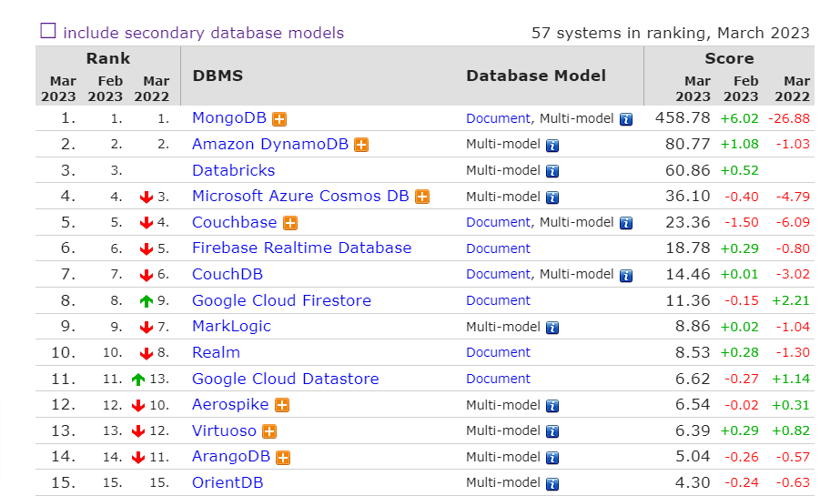
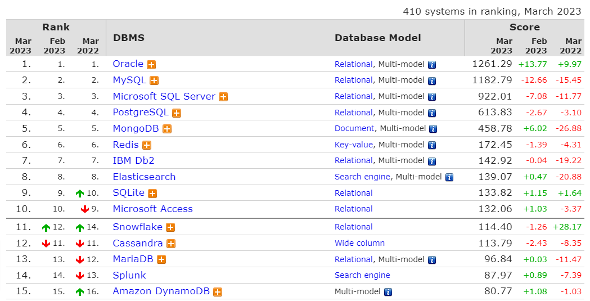
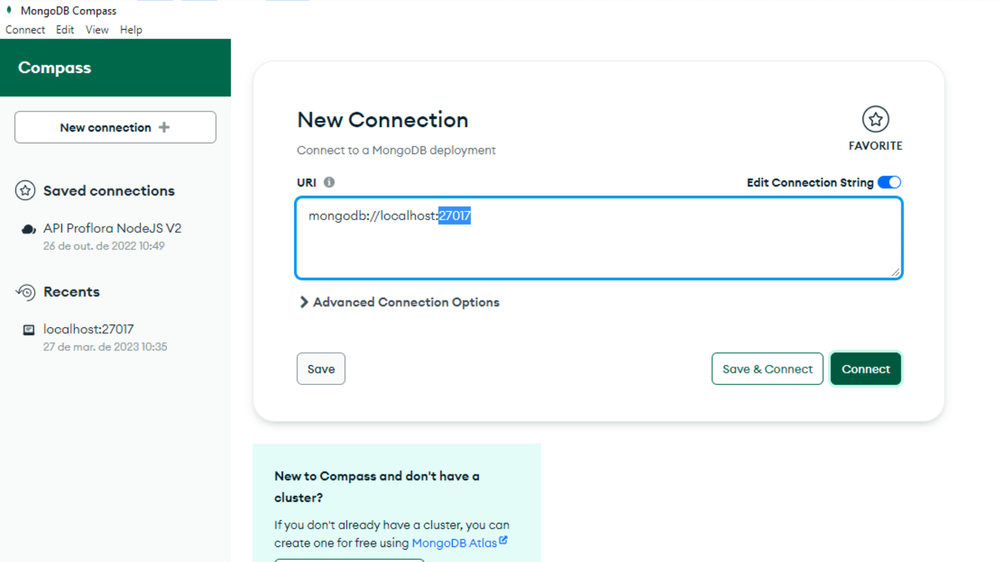
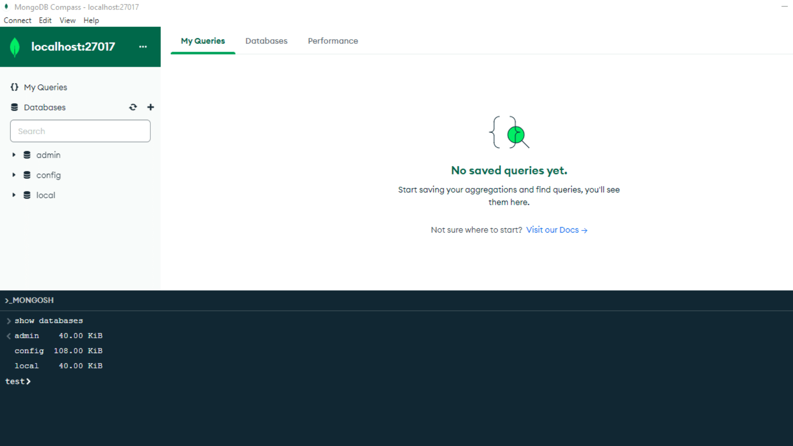

# Treinamento MongoDB

Vicente Calfo

<small>vicentecalfo@gmail.com</small>
<small>https://www.linkedin.com/in/vicentecalfo/</small>

---

# Banco de Dados NoSQL

- NoSQL -> **Não SQL** ou não relacional;
- Atualmente o termo NoSQL evoluiu pata **Not Only SQL** ou não somente SQL;
- Banco de dados NoSQL tem sido usado para *Big Data* e *Data Science*;


<small style="font-size:20px">**SQL** -> *Structured Query Language*</small>
<small style="font-size:20px">**Big Data** -> conjunto de dados maior e complexo (dados volumosos de diferente base de dados e processados com velocidade - 3Vs: Volume, Variedade e Velocidade)</small>
<small style="font-size:20px">**Data Science** -> A principal função da ciência de dados é transformar dados, estruturados ou não, em conhecimento para uma empresa ou projeto</small>

---

# Banco de Dados Relacionais

- Bancos mais utilizados desde de 1970;
- Formato de Tabelas (linhas x colunas);
- Uso de chaves primarias (PK) e chaves estrangeiras (FK);
- Limitação de uso:
    - Escala (petabytes);
    - Perda de performance em relacionamento de grande conjunto de dados (*joins*);
    - Dificuldade na modelagem de esquemas complexos.

---

# Bancos NoSQL Linha do Tempo

- Termo surgido em 1998 por Carlo Strozzi para nomear uma estrutura de banco mais leve não exposta ao SQL e de código aberto;
- Em 2006 o Google publica um artigo: BigTable: A Distributed Storage System for Structred Data" - chamando a atenção para o tema NoSQL;
- Nos últimos anos os banco de dados NoSQL tem aumentado significativamente;

---

# Bancos NoSQL

- Não usam **SQL**;
- Formas de organização: **NÃO USAM TABELAS** - usam grafos, documentos e colunas visando melhor performance;
- Clusterização: Executar o banco de dados em várias máquinas ao mesmo tempo;
- Usam esquemas flexíveis (formatos diferentes para o mesmo tipo de registro);
- Escalabilidade Horizontal (amigável);

<small style="font-size:20px">Escalabilidade vertical (scaling up) -> adicionar hardware mais poderosos (ex.: CPU, memórias, disco).</small>
<small style="font-size:20px">Escalabilidade horizontal (scaling out) -> adicionar clones do mesmo servidor lado a lado e distribuir as solicitações.</small>
<small style="font-size:20px">https://db-engines.com/en/ranking/document+store</small>

---

# Ranking NoSQL


---

# Ranking Geral


---

# MongoDB

- Nome derivado da palavra inglesa "Humongous" (imenso);
- Banco de dados NoSQL de código aberto;
- Gratuito;
- Alta performance;
- Sem esquemas;
- Orientado a documentos;
- Criados em 2009 para atender grandes volumes de dados.

---

# Ecossistema Mongo

- MongoDB Charts (visualização de dados através de dashboards);
- MongoDB Atlas (hospedagem de banco na nuvem);
- MongoDB DataLake (agregação);
- MongoDB Stitch (plataforma servless - autenticação e acesso ao DB);
- MongoDB Compass (ferramenta gráfcia para conexaão e manipulação de dados).

<small style="font-size:18px;">O **data lake** é um repositório centralizado projetado para armazenar, processar e proteger grandes quantidades de dados estruturados, semiestruturados e não estruturados. Ele pode armazenar dados em seu formato nativo e processar qualquer variedade desses dados, ignorando os limites de tamanho.</small>

---

# Formato de documento - BSON

- Documentos em **BSON** (representação binária do padrão **JSON**);
- Tipos de dados padrão:
    - boleanos (true/false);
    - strings;
    - números;
    - null (nulo);
    - arrays (listas);
    - objetos/documentos (objects).

---

# JSON - Tipos

```json

{
	"primeiroNome": "John",
	"segundoNome": "Smith",
	"idade": 32,
	"estrangeiro": false,
	"enderaco": {
		"rua": "Adalberto da Silveira",
		"numero": 25,
		"complemento": "apto 307",
		"cidade": "Rio de Janeiro",
		"estado": "RJ",
		"cep": null
	},
	"telefones": [{
			"tipo": "casa",
			"numero": "212 555-1234"
		},
		{
			"tipo": "celular",
			"numero": "646 555-4567"
		}
	]
}

```
---

# MongoDB - Terminologia

### Relação de nomes usados nos banco de dados relacionais e no MongoDB


| Relacional DB    | MongoDB        |
|------------------|----------------|
| Banco de Dados   | Banco de Dados |
| Tabela           | Coleção        |
| Linha (Registro) | Documento      |
| Coluna | Campo      |

---

# MongoDB - Documento

- Cada documento sempre terá o campo: **_id**.

```js
{
	"_id": ObjectId("536gfst785hfg896jgh90iju8gdtdf5"),
	"primeiroNome": "John",
	"segundoNome": "Smith",
	"idade": 32,
	"estrangeiro": false,
	"enderaco": {
		"rua": "Adalberto da Silveira",
		"numero": 25,
		"complemento": "apto 307",
		"cidade": "Rio de Janeiro",
		"estado": "RJ",
		"cep": null
	},
	"telefones": [{
			"tipo": "casa",
			"numero": "212 555-1234"
		},
		{
			"tipo": "celular",
			"numero": "646 555-4567"
		}
	]
}

```

---

# MongoDB Atlas

- Criar uma conta no MongoDB Atlas para descobrir o MongoDB
    - https://www.mongodb.com/atlas/database;
    - Usar sua conta do Google (para facilitar).

---

# Download MongoDB

- Link: https://www.mongodb.com/try/download/community

---

# MongoDB

- A porta padrão de instalação do MongoDB é a 27017;



---

# MongoDB Compass Terminal



---

# Comandos Básicos MongoDB

## Para exibir os banco de dados existentes

```bash

show databases

```

---

# Comandos Básicos MongoDB

## Para escolher um banco de dados

```bash

use nome-do-database-desejado

```

---

# Comandos Básicos MongoDB

## Criar um banco de dados

Enquanto você não criar ao menos uma coleção o banco de dados não será criado.
**Obs.:** O mongo considera letras maiúsculas e minusculas (camelcase) no momento de criação das coleções.

```bash

use nome-do-banco

db.createCollection('minha-colecao')

```

---

# Comandos Básicos MongoDB

Quando você apagar todas as coleções de um banco o banco será apagado também.

## Apagar uma coleção

```bash

db.nomedacollection.drop()

```

---

# Comandos Básicos MongoDB


## Apagar um Banco de Dados

```bash

db.dropDatabase()

```

---


# Comandos Básicos MongoDB

Listar todas as coleções de um banco de dados.

## Listar as coleções
```bash

show collections

```

---

# Comandos Básicos MongoDB


## Inserir Documento
```bash

db.colecao-desejada.insertOne({"name":"Vicente"})

```

---

# Comandos Básicos MongoDB


## Inserir Vários Documentos
```bash

db.colecao-desejada.insertMany([{"name":"Felipe"},{"name":"André"}])

```

---

# Comandos Básicos MongoDB


## Buscar todos os Documentos
```bash

db.colecao-desejada.find()

```

---


# Comandos Básicos MongoDB


## Buscar um Documento em específico
```bash

db.colecao-desejada.find({"name":"André"})

```

---

# Comandos Básicos MongoDB


## Limitando a Busca de Documentos
```bash

db.colecao-desejada.find().limit(2)

```

---

# Comandos Básicos MongoDB


## Buscando um Documento por ID

```bash

db.colecao-desejada.find({_id:ObjectId("6421aa850ed20a9bf32cf818")})

```

---

# Comandos Básicos MongoDB


## Retornando apenas os campos desejados

O documento retornado só mostrará o campo "name".
O campo **"_id"** sempre vai ser mostrado a não ser que explicitamento seja informado o contrário.

```bash

db.colecao-desejada.find({name:"Felipe"}, {"_id": 0, "name": 1})

```

---

# Comandos Básicos MongoDB


## Retornando a quantidade de documentos numa coleção


```bash

db.colecao-desejada.find().count()

```

---

# Comandos Básicos MongoDB


## Removendo um documento


```bash

db.colecao-desejada.deleteOne({_id:ObjectId("6421aa850ed20a9bf32cf818")})

```

---

# Comandos Básicos MongoDB


## Atualizando um documento


```bash

db.colecao-desejada.updateOne(
	{_id:ObjectId("6421aa850ed20a9bf32cf818")}
	{$set:{
		'idade':48
	}}
	)

```

---

# Operadores Atômicos

$set

Ele é utilizado para especificar uma chave e atualizar a chave.
Se a chave não exist ela é criada.

```bash

{ $set : { field : value } }

```

---

# Operadores Atômicos

$unset

Para remover uma chave.

```bash

{ $unset : { field : 1} }

```

---

# Operadores Atômicos

$inc

Para incrementar e decrementar valores

```bash

{ $inc : { field : 1 } }

{ $inc : { field : -1 } }

```

---

# Operadores Condicionais

$gt 

Operador de maior (>).

```bash

db.col.find({"idade" : {$gt : 30}})

```

---

# Operadores Condicionais

$gte 

Operador de maior igual (>=).

```bash

db.col.find({"idade" : {$gte : 40}})

```

---

# Operadores Condicionais

$lt 

Operador de menor (<).

```bash

db.col.find({"idade" : {$lt : 45}})

```

---

# Operadores Condicionais

$lte 

Operador de maior igual (<=).

```bash

db.col.find({"idade" : {$lte : 48}})

```


