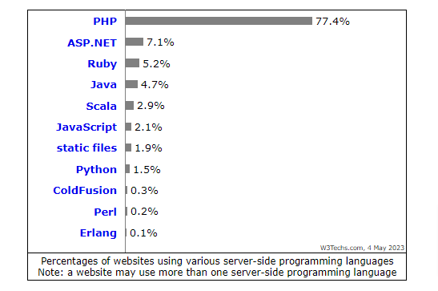

# Treinamento PHP

## Aula 1

Vicente Calfo

<small>vicentecalfo@gmail.com</small>
<small>https://www.linkedin.com/in/vicentecalfo/</small>

---

# Instalação

1. Link para download: https://windows.php.net/download#php-8.2
2. Descompactar o "zip"
3. Abrir "variáveis de ambiente"
4. Selecionar "Path" e "editar"
5. Clicar em novo e colar o caminho da pasta na qual os arquivos do ZIP foram extraídos
6. Abrir o terminal (cmd)
7. Digitar > <code>php -v</code> (verificar a versão instalada)
8. Na pasta da instalação renomear o arquivo <code>php.ini-development</code> para <code>php.ini</code>

---

# PHP - Hypertext Preprocessor

- Linguagem criada em 1994 e código liberado em 1995 (+/- 28 anos de idade);

- Lnguagem de programação de código aberto e voltada para a web, usada principalmente para desenvolvimento de aplicações web dinâmicas;

- É uma linguagem de script do lado do servidor (back-end);

- Compatível com diversos bancos de dados, incluindo MySQL e PostgreSQL;

- Fácil de aprender e possui uma grande comunidade de desenvolvedores;

---

# Utilização do PHP



https://w3techs.com/technologies/overview/programming_language

---

# PHP CLI

1. Abrir o terminal (cmd)
2. Digitar <code>php -a</code> (abrir o shell interativo)
3. Digitar <code>echo "olá mundo";</code> (precisa de ; no final)
4. Digitar <code>quit</code>
5. Limpar terminal > digital <code>cls</code>

---

# Configuração do Editor de Código

1. VS Code: https://code.visualstudio.com
2. PHP Debug: https://marketplace.visualstudio.com/items?itemName=xdebug.php-debug
3. PHP Intelephense: https://marketplace.visualstudio.com/items?itemName=bmewburn.vscode-intelephense-client
4. PHPDoc Comment: https://marketplace.visualstudio.com/items?itemName=rexshi.phpdoc-comment-vscode-plugin
5. Prettier: https://marketplace.visualstudio.com/items?itemName=esbenp.prettier-vscode
6. Abrir terminal <code>ctrl + shift + '</code> (escolher Command Prompt - CMD)

---

# Primeiro arquivo PHP

1. Criar um arquivo chamado <code>ola-mundo.php</code>
2. Colocar a tag obrigatória o arquivo

```php
<?php
/*
    <?php é obrigatório
     para o interpretador PHP "saber" como
     executar nossas instruções
*/
echo "Olá Mundo";
```

3. No terminal navegar até a pasta onde está o arquivo criado
4. Digitar: <code>php ola-mundo.php</code>

---

# Comentários

```php
<?php
/*
    Isso é um comentário em "bloco" (block)
    <?php é obrigatório
    para o interpretador PHP "saber" como
    executar nossas instruções
*/
echo "Olá Mundo";

// Isso é um comentário de "linha" (inline)
```

---

# DocBlocks

- Usado para documentar o código em comentários de bloco padronizado
- O DockBlock começa com /\*\* , eles tem origem no javadoc e podem (ou não) ter uma infinidades de tags que começam com @
- Ferramentas como PHPDoc e ApiGen usam esses comentários para gerar documentação automaticamente

---

# Exemplo DocBlocks

```php
<?php
/**
 * Esta é a classe de produtos ...
 * @author Vicente Calfo <vicentecalfo@gmail.com>
 * @version 1.0
 */

class Produto {
    /**
     * @access private
     * @var Number $codigo
     * @var String $nome
     */
    private $codigo;
    private $nome;

     /**
     * Usado para atribuir o nome de um produto
     * @access public
     * @param String $nome
     */
    function setNome($nome){
        //...
    }
}
```

---

# Variável

1. Uma variável em uma linguagem de programação é uma entidade que representa um espaço de armazenamento na memória RAM do programa, no qual podemos armazenar informações.
2. Uma vez que uma informação é armazenada em uma variável, é possível realizar operações sobre ela, modificar seu valor e usá-la de diferentes maneiras posteriormente.

---

# Variável em PHP

1. Precisamos usar o símbolo **\$** seguido do nome da variável: <code>$variavel;</code>
1. Para atribuir um valor à varipavel usamos o operador **=**: <code>$idade = 40;</code>
1. Todas as variáveis são _case-sensitive_: <code>$idade != $Idade</code>

```php
<?php
// variavel.php
$idade = 40;
echo $idade;

$nome = "Vicente Calfo";
echo $nome;
```
---

# Código Limpo

Os nomes das variáveis devem ter significado, e que possam ser pronunciados.

```php

    $ymdstr = $momento->format('y-m-d');

    $dataAtual = $momento->format('y-m-d');

```

---

# Convenções - PSR

## PHP Standard Recommendation

- Nome de variável em <code>camelCase</code>: Ex.: <code>$nomeDoUsuario</code>
- Devemos usar somente as tags de abertura de código PHP <code><?php</code> ou <code><?=</code>

---

# Escopo

1.  Determina onde a variável foi definida e onde ela pode ser usada dentro do programa.
1.  É importante porque ajuda a evitar conflitos de nomes de variáveis e permite que as variáveis sejam reutilizadas em diferentes partes do código

---

# Escopo em PHP

No PHP nós temos 3 diferentes tipos de escopo de varíaveis:

- local
- global
- static

---

# Escopo Local

Variáveis definidas em uma função em PHP são locais e têm escopo limitado à própria função.

```php
<?php
// var-local.php
function varLocal() {
    $var_local = "Essa é uma variável local.";
    echo $var_local;
  }

varLocal();

echo "\n---->";
echo $var_local; // Está vazio -> fora do escopo
```

---

# Escopo Local Static

Quando uma função é executada em PHP, todas as suas variáveis são normalmente excluídas, mas às vezes precisamos manter uma variável local para uma tarefa posterior.

Para fazer isso, use a palavra-chave <code>static</code> ao declarar a variável pela primeira vez.

---

O nosso _output_ sempre será 0 (zero).

```php
// var-local-static.php
function local()
{
    $x = 0;
    echo $x;
    echo "\n";
    $x++;
}

local();
local();
local();

```

---

O _output_ será incrementado mostrando 0,1 e 2. Porque usando <code>static</code> nós "guardamos" o valor de <code>\$x</code>:

```php
// var-local-static.php
// Incluir esta nova função
function localStatic()
{
    static $x = 0;
    echo $x;
    echo "\n";
    $x++;
}

// Atualizar nossos outputs
local();
local();
local();
echo "-----------------------------\n";
localStatic();
localStatic();
localStatic();

```

---

# Escopo Global

As variáveis globais em PHP podem ser definidas fora de funções/métodos ou declaradas global dentro de uma função, permitindo acesso em todo o código.

```php
<?php
// var-global.php
$var_global = "Essa é uma variável global.";

function varGlobal()
{
    global $var_global; //variável global é acessada usando a palavra-chave global
    echo $var_global;
}

varGlobal();

echo "\n---->";
echo $var_global; // Mesmo valor por global "não respeita o escopo"
```

---

As variáveis globais em PHP são armazenadas em um array chamado $GLOBALS, acessível em todo o código e capaz de atualizar as variáveis globais diretamente.

```php
<?php
// var-global.php
// ...
function varGlobal2()
{
    echo $GLOBALS['var_global'];
}

varGlobal();
echo "\n---->";
varGlobal2();
echo "\n---->";
echo $var_global;
```

---

# Data Types

O PHP suporta nativamente diversos tipos de dados (datatypes), incluindo:

- String
- Integer
- Float (Números de ponto flutuante - também chamados de _double_.)
- Boolean
- Array
- Object
- NULL

---

# Data Types

## String

- Uma string é uma sequência de caracteres, como "Olá mundo!".
- Uma string pode ser qualquer texto entre aspas. Você pode usar aspas simples ou duplas:

```php
<?php
// data-types.php
$string = "Sou uma string!";
echo $string;
echo "\n"; // sou apenas para quebrar a linha no terminal
```

---

# Data Types

## Integer (Inteiro)

- Integer é um tipo de dado em PHP que representa um número inteiro sem ponto decimal;
- Pode ser um número positivo ou negativo;
- O valor máximo e mínimo depende da plataforma em que o PHP está sendo executado;
- Geralmente varia de `-2.147.483.648` a `2.147.483.647`;
- É frequentemente usado para contar ou para representar quantidades inteiras.

---

# Data Types

## Integer (Inteiro)

A função <code>var_dump()</code> do PHP retorna o tipo de dado e o valor.

```php
<?php
// data-types.php

$int = 2023;
var_dump($int);
```

---

# Data Types

## Float

Um float (número de ponto flutuante) é um número com um ponto decimal ou um número em forma exponencial.

```php
<?php
// data-types.php

$float = 150.980;
var_dump($float);
```

---

# Data Types

## Boolean

Um Boolean representa dois estados possíveis: **VERDADEIRO** ou **FALSO**.

```php
<?php
// data-types.php

$verdadeiro = true;
var_dump($verdadeiro);

$falso = false;
var_dump($falso);
```

---

# Data Types

## Array

Um array armazena múltiplos valores em uma única variável.

```php
<?php
// data-types.php

$nomes = array("Vicente", "Austeclynio", "Fernando");
var_dump($nomes);
```

---

# Data Types

## Object

- Classes e objetos são os dois principais aspectos da **programação orientada a objetos**.
- Uma classe é um modelo para objetos, e um objeto é uma instância de uma classe.
- Quando os objetos individuais são criados, eles herdam todas as propriedades e comportamentos da classe, mas cada objeto terá valores diferentes para as propriedades.

---

# Orientação a Objetos

A orientação a objetos é um paradigma de programação que organiza o código em torno de "objetos" que possuem propriedades e métodos.

- Imagine que um objeto seja como uma pessoa, que tem **características** (**propriedades**) como nome, idade e altura, e **comportamentos** (**métodos**) como andar, falar e comer.
- Com a orientação a objetos, escrevemos código de forma mais organizada, agrupando funções em objetos e utilizando-os como unidades no programa.

---

# Exemplo Object

```php
<?php
// data-types.php

class Pessoa {
    public $nome;
    public $idade;
    public function __construct($nome, $idade) {
      $this->nome = $nome;
      $this->idade = $idade;
    }
    public function boasVindas() {
      return "Seja bem-vindo, " . $this->nome . "! Nunca é tarde para aprender PHP, mesmo aos " . $this->idade . " anos.";
    }
  }

  $pessoa = new Pessoa("Vicente", 40);
  echo $pessoa -> boasVindas();
  echo "\n";
  var_dump($pessoa);
  echo $pessoa->nome;
```

---

# Data Types

## NULL

- NULL é um tipo de dados especial que pode ter apenas um valor: NULL.
- Uma variável do tipo NULL é uma variável que não tem nenhum valor atribuído a ela.
- Se uma variável é criada sem um valor, ela é automaticamente atribuída como NULL.
- Variáveis também podem ser esvaziadas atribuindo o valor NULL.

---

# Exemplo NULL

```php
<?php
// data-types.php
echo "\n";

$tenhoValorMasVouFicarNulo = "Por pouco tempo terei valor";
var_dump($tenhoValorMasVouFicarNulo);
$tenhoValorMasVouFicarNulo = null;
var_dump($tenhoValorMasVouFicarNulo);
$soDeclarei;
var_dump($soDeclarei);
```

---

# Tipagem Estática

- Não permite a alteração do tipo da variável após sua declaração.
- Ajuda a prevenir erros de tipo em tempo de execução, o que pode levar a uma maior estabilidade e segurança do código.

# Tipagem Dinâmica

- As variáveis podem ter seu tipo alterado em tempo de execução.
- A flexibilidade na mudança de tipos de dados pode permitir uma programação mais ágil e rápida.

---

# Tipagem Fraca

- A tipagem fraca está ligada a característica da linguagem de realizar conversões automaticamente entre tipos diferentes de dados.

# Tipagem Forte

- Linguagens fortemente tipadas não realizam conversões automaticamente.

---

# Exemplo

## Tipagem Fraca

```php
<?php
// tipagem.php
$num = 2;
$numFake = "2";

echo gettype($num);
echo "\n";
echo gettype($numFake);
echo "\n";
echo $num + $numFake;
echo "\n";
var_dump($num == $numFake);
echo "\n";
var_dump($num === $numFake);

```

---

# Operações Matemáticas: Soma <code>+</code>

```php
<?php
// operacoes.php
$precoProdutoA = 30;
$precoProdutoB = 40;
$frete = 10;
$desconto = 5;
$qtdCartao = 4;
$totalUnidadesCompradas = 5;

echo "Valor do produto A: R$ " . $precoProdutoA;
echo "\n";
echo "Valor do produto B: R$ " . $precoProdutoB;
echo "\n";
echo "Valor do frete: R$ " . $frete;
echo "\n";
$totalCompra = $precoProdutoA + $precoProdutoB + $frete;
echo "Total da compra é de R$ " . $totalCompra;
echo "\n";

```

---

# Operações Matemáticas: Subtração <code>-</code>

```php
<?php
// operacoes.php

// ...

$totalCompraDesconto =  $totalCompra - $desconto;
echo "Total da compra com desconto (R$ " . $desconto . ") é de R$ " . $totalCompraDesconto;
echo "\n";
```

---

# Operações Matemáticas: Multiplicação <code>\*</code>

```php
<?php
// operacoes.php

// ...

$totalComprandoProdutoAXUnidades = $precoProdutoA * $totalUnidadesCompradas + $frete;

echo "Você comprou " . $totalUnidadesCompradas .
" unidades do produto A (R$" . $precoProdutoA . ").
Valor final de R$ " . $totalComprandoProdutoAXUnidades .
" (R$ " .  $precoProdutoA . " x " . $totalUnidadesCompradas .
" + frete de R$ " . $frete . ")";
echo "\n";
```

---

# Operações Matemáticas: Divisão <code>/</code>

```php
<?php
// operacoes.php

// ...

$dividindoTotalEm2Cartoes = $totalCompra / $qtdCartao;

echo "Você dividiu sua compra de R$ " . $totalCompra .
" em " . $qtdCartao . " cartões. Será debitado R$" . $dividindoTotalEm2Cartoes .
" em cada cartão.";

echo "\n";
```

---

# Operações Matemáticas: Potência <code>\*\*</code>

```php
<?php
// operacoes.php

// ...

$cuboAresta = 6; // cm
$volumeCubo = 6 * 6 * 6; //cm2
$volumeCuboOperadorPotencia = $cuboAresta ** 3; //cm2

echo "Volume: " . $volumeCubo;
echo "\n";
echo "Volume usando operador de potência: " . $volumeCuboOperadorPotencia;
```

---

# Operações Matemáticas: Modulus <code>%</code>

```php
<?php
// operacoes.php

// ...

$restoDaDivisao = 15 % 2;

echo "Resto da divisão: " . $restoDaDivisao;
echo "\n";
```

---

# Interpolação e concatenação de string

- Usando <code>aspas simples</code> precisamos <code>concatenar</code> os blocos usando <code>.</code> (ponto).
- Usando <code>aspas dupla</code>s é possível realizar a <code>interpolação</code> de <code>strings</code>.

```php
// interpolacao-string.php
$idade = 40;
$nome = "Vicente Calfo";
$msg = 'Sou o ' . $nome . ' e tenho ' . $idade . ' anos.'; // concatenação
$msg2 = "Sou o " . $nome . " e tenho " . $idade . " anos."; // concatenação
$msg3 = "Sou o $nome e tenho $idade anos."; // interpolação
$msg4 = "Sou o {$nome} e tenho {$idade} anos."; // interpolação
echo $msg;
echo "\n";
echo $msg2;
echo "\n";
echo $msg3;
echo "\n";
echo $msg4;
```

---

# Quebras de Linha - EOL

## END OF LINE

```php

// \n
// \r\n -> quebras de linha arquivo texto windows

// EOL -> End Of Line -> já resolve a quebra de linha com base no sistema operacional

echo "Olá Você!" . PHP_EOL;

echo "Viu! Quebrou a linha...";
echo "Viu! Quebrou a linha...";
echo "Se não indicar quebra de linha FICA TUDO JUNTO!";


```


---

# Operadores de Comparação
# == e ===

- <code>==</code> é igual -> Retorna *true* ou *false* se for igual
- <code>===</code> é idêntico -> Retorna  *true* ou *false* se for igual e do mesmo tipo

```php

$testEq = 12 == '12' ? 'SIM' : 'NÃO' ;
$testIdt = 12 === '12' ? 'SIM' : 'NÃO';

echo $testEq;
echo PHP_EOL;
echo $testIdt;

```

--- 


# Tomando Decisões - IF/ELSE

```php

//if.php

 $hora = 17;

 if($hora < 17){
    echo "Tenha um bom dia.";
 }

 $isEqual = $hora === 17;

 echo $isEqual; // não vai imprimir nada
 echo PHP_EOL;
 var_dump($isEqual);

 if($isEqual){
   echo "Sou idêntico.";
 }else{
   echo "Não sou idêntico.";
 }

```

--- 

# Código Limpo

Colocar as condições em variáveis com nomes que façam sentido.

```php

$saldo = 10;
$preco = 5;
$temSaldo = $saldo >= $preco;

if ($temSaldo) {
   echo "Posso comprar.";
} else {
   echo "Não posso comprar.";
}

```

---

# Operador Ternário

<code>(condição) ? (declaração 1) : (declaração 2)</code>

```php

$testEq = 12 == '12' ? 'SIM' : 'NÃO' ;

```
- Código mais curto
- Código mais legível
- Mais fácil de ler


---

# Loops

```php

$colors = array("red", "green", "blue", "yellow");
foreach ($colors as $value) {
  echo "$value <br>";
}

$x = 1;

while($x <= 5) {
  echo "The number is: $x <br>";
  $x++;
} 


```

