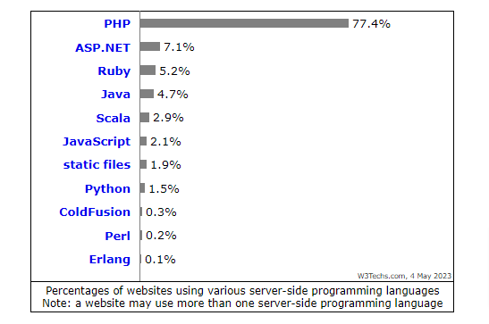

# Treinamento PHP

## Aula 1

Vicente Calfo

<small>vicentecalfo@gmail.com</small>
<small>https://www.linkedin.com/in/vicentecalfo/</small>

---

# Instalação

1. Link para download: https://windows.php.net/download#php-8.2
2. Descompactar o "zip"
3. Abrir "variáveis de ambiente"
4. Selecionar "Path" e "editar"
5. Clicar em novo e colar o caminho da pasta na qual os arquivos do ZIP foram extraídos
6. Abrir o terminal (cmd)
7. Digitar > <code>php -v</code> (verificar a versão instalada)
8. Na pasta da instalação renomear o arquivo <code>php.ini-development</code> para <code>php.ini</code>

---

# PHP - Hypertext Preprocessor

- Linguagem criada em 1994 e código liberado em 1995 (+/- 28 anos de idade);

- Lnguagem de programação de código aberto e voltada para a web, usada principalmente para desenvolvimento de aplicações web dinâmicas;

- É uma linguagem de script do lado do servidor (back-end);

- Compatível com diversos bancos de dados, incluindo MySQL e PostgreSQL;

- Fácil de aprender e possui uma grande comunidade de desenvolvedores;

---

# Utilização do PHP



https://w3techs.com/technologies/overview/programming_language

---

# PHP CLI

1. Abrir o terminal (cmd)
2. Digitar <code>php -a</code> (abrir o shell interativo)
3. Digitar <code>echo "olá mundo";</code> (precisa de ; no final)
4. Digitar <code>quit</code>
5. Limpar terminal > digital <code>cls</code>

---

# Configuração do Editor de Código

1. VS Code: https://code.visualstudio.com
2. PHP Debug: https://marketplace.visualstudio.com/items?itemName=xdebug.php-debug
3. PHP Intelephense: https://marketplace.visualstudio.com/items?itemName=bmewburn.vscode-intelephense-client
4. PHPDoc Comment: https://marketplace.visualstudio.com/items?itemName=rexshi.phpdoc-comment-vscode-plugin
5. Prettier: https://marketplace.visualstudio.com/items?itemName=esbenp.prettier-vscode
6. Abrir terminal <code>ctrl + shift + '</code> (escolher Command Prompt - CMD)

---

# Primeiro arquivo PHP

1. Criar um arquivo chamado <code>ola-mundo.php</code>
2. Colocar a tag obrigatória o arquivo

```php
<?php
/*
    <?php é obrigatório
     para o interpretador PHP "saber" como
     executar nossas instruções
*/
echo "Olá Mundo";
```

3. No terminal navegar até a pasta onde está o arquivo criado
4. Digitar: <code>php ola-mundo.php</code>

---

# Comentários

```php
<?php
/*
    Isso é um comentário em "bloco" (block)
    <?php é obrigatório
    para o interpretador PHP "saber" como
    executar nossas instruções
*/
echo "Olá Mundo";

// Isso é um comentário de "linha" (inline)
```

---

# DocBlocks

- Usado para documentar o código em comentários de bloco padronizado
- O DockBlock começa com /\*\* , eles tem origem no javadoc e podem (ou não) ter uma infinidades de tags que começam com @
- Ferramentas como PHPDoc e ApiGen usam esses comentários para gerar documentação automaticamente

---

# Exemplo DocBlocks

```php
<?php
/**
 * Esta é a classe de produtos ...
 * @author Vicente Calfo <vicentecalfo@gmail.com>
 * @version 1.0
 */

class Produto {
    /**
     * @access private
     * @var Number $codigo
     * @var String $nome
     */
    private $codigo;
    private $nome;

     /**
     * Usado para atribuir o nome de um produto
     * @access public
     * @param String $nome
     */
    function setNome($nome){
        //...
    }
}
```

---

# Variável

1. Uma variável em uma linguagem de programação é uma entidade que representa um espaço de armazenamento na memória RAM do programa, no qual podemos armazenar informações.
2. Uma vez que uma informação é armazenada em uma variável, é possível realizar operações sobre ela, modificar seu valor e usá-la de diferentes maneiras posteriormente.

---

# Variável em PHP

1. Precisamos usar o símbolo **\$** seguido do nome da variável: <code>$variavel;</code>
1. Para atribuir um valor à varipavel usamos o operador **=**: <code>$idade = 40;</code>
1. Todas as variáveis são _case-sensitive_: <code>$idade != $Idade</code>

```php
<?php
// variavel.php
$idade = 40;
echo $idade;

$nome = "Vicente Calfo";
echo $nome;
```

---

# Código Limpo

Os nomes das variáveis devem ter significado, e que possam ser pronunciados.

```php

    $ymdstr = $momento->format('y-m-d');

    $dataAtual = $momento->format('y-m-d');

```

---

# Convenções - PSR

## PHP Standard Recommendation

- Nome de variável em <code>camelCase</code>: Ex.: <code>$nomeDoUsuario</code>
- Devemos usar somente as tags de abertura de código PHP <code><?php</code> ou <code><?=</code>

---

# Escopo

1.  Determina onde a variável foi definida e onde ela pode ser usada dentro do programa.
1.  É importante porque ajuda a evitar conflitos de nomes de variáveis e permite que as variáveis sejam reutilizadas em diferentes partes do código

---

# Escopo em PHP

No PHP nós temos 3 diferentes tipos de escopo de varíaveis:

- local
- global
- static

---

# Escopo Local

Variáveis definidas em uma função em PHP são locais e têm escopo limitado à própria função.

```php
<?php
// var-local.php
function varLocal() {
    $var_local = "Essa é uma variável local.";
    echo $var_local;
  }

varLocal();

echo "\n---->";
echo $var_local; // Está vazio -> fora do escopo
```

---

# Escopo Local Static

Quando uma função é executada em PHP, todas as suas variáveis são normalmente excluídas, mas às vezes precisamos manter uma variável local para uma tarefa posterior.

Para fazer isso, use a palavra-chave <code>static</code> ao declarar a variável pela primeira vez.

---

O nosso _output_ sempre será 0 (zero).

```php
// var-local-static.php
function local()
{
    $x = 0;
    echo $x;
    echo "\n";
    $x++;
}

local();
local();
local();

```

---

O _output_ será incrementado mostrando 0,1 e 2. Porque usando <code>static</code> nós "guardamos" o valor de <code>\$x</code>:

```php
// var-local-static.php
// Incluir esta nova função
function localStatic()
{
    static $x = 0;
    echo $x;
    echo "\n";
    $x++;
}

// Atualizar nossos outputs
local();
local();
local();
echo "-----------------------------\n";
localStatic();
localStatic();
localStatic();

```

---

# Escopo Global

As variáveis globais em PHP podem ser definidas fora de funções/métodos ou declaradas global dentro de uma função, permitindo acesso em todo o código.

```php
<?php
// var-global.php
$var_global = "Essa é uma variável global.";

function varGlobal()
{
    global $var_global; //variável global é acessada usando a palavra-chave global
    echo $var_global;
}

varGlobal();

echo "\n---->";
echo $var_global; // Mesmo valor por global "não respeita o escopo"
```

---

As variáveis globais em PHP são armazenadas em um array chamado $GLOBALS, acessível em todo o código e capaz de atualizar as variáveis globais diretamente.

```php
<?php
// var-global.php
// ...
function varGlobal2()
{
    echo $GLOBALS['var_global'];
}

varGlobal();
echo "\n---->";
varGlobal2();
echo "\n---->";
echo $var_global;
```

---

# Data Types

O PHP suporta nativamente diversos tipos de dados (datatypes), incluindo:

- String
- Integer
- Float (Números de ponto flutuante - também chamados de _double_.)
- Boolean
- Array
- Object
- NULL

---

# Data Types

## String

- Uma string é uma sequência de caracteres, como "Olá mundo!".
- Uma string pode ser qualquer texto entre aspas. Você pode usar aspas simples ou duplas:

```php
<?php
// data-types.php
$string = "Sou uma string!";
echo $string;
echo "\n"; // sou apenas para quebrar a linha no terminal
```

---

# Data Types

## Integer (Inteiro)

- Integer é um tipo de dado em PHP que representa um número inteiro sem ponto decimal;
- Pode ser um número positivo ou negativo;
- O valor máximo e mínimo depende da plataforma em que o PHP está sendo executado;
- Geralmente varia de `-2.147.483.648` a `2.147.483.647`;
- É frequentemente usado para contar ou para representar quantidades inteiras.

---

# Data Types

## Integer (Inteiro)

A função <code>var_dump()</code> do PHP retorna o tipo de dado e o valor.

```php
<?php
// data-types.php

$int = 2023;
var_dump($int);
```

---

# Data Types

## Float

Um float (número de ponto flutuante) é um número com um ponto decimal ou um número em forma exponencial.

```php
<?php
// data-types.php

$float = 150.980;
var_dump($float);
```

---

# Data Types

## Boolean

Um Boolean representa dois estados possíveis: **VERDADEIRO** ou **FALSO**.

```php
<?php
// data-types.php

$verdadeiro = true;
var_dump($verdadeiro);

$falso = false;
var_dump($falso);
```

---

# Data Types

## Array

Um array armazena múltiplos valores em uma única variável.

```php
<?php
// data-types.php

$nomes = array("Vicente", "Austeclynio", "Fernando");
var_dump($nomes);
```

---

# Data Types

## Object

- Classes e objetos são os dois principais aspectos da **programação orientada a objetos**.
- Uma classe é um modelo para objetos, e um objeto é uma instância de uma classe.
- Quando os objetos individuais são criados, eles herdam todas as propriedades e comportamentos da classe, mas cada objeto terá valores diferentes para as propriedades.

---

# Orientação a Objetos

A orientação a objetos é um paradigma de programação que organiza o código em torno de "objetos" que possuem propriedades e métodos.

- Imagine que um objeto seja como uma pessoa, que tem **características** (**propriedades**) como nome, idade e altura, e **comportamentos** (**métodos**) como andar, falar e comer.
- Com a orientação a objetos, escrevemos código de forma mais organizada, agrupando funções em objetos e utilizando-os como unidades no programa.

---

# Exemplo Object

```php
<?php
// data-types.php

class Pessoa {
    public $nome;
    public $idade;
    public function __construct($nome, $idade) {
      $this->nome = $nome;
      $this->idade = $idade;
    }
    public function boasVindas() {
      return "Seja bem-vindo, " . $this->nome . "! Nunca é tarde para aprender PHP, mesmo aos " . $this->idade . " anos.";
    }
  }

  $pessoa = new Pessoa("Vicente", 40);
  echo $pessoa -> boasVindas();
  echo "\n";
  var_dump($pessoa);
  echo $pessoa->nome;
```

---

# Data Types

## NULL

- NULL é um tipo de dados especial que pode ter apenas um valor: NULL.
- Uma variável do tipo NULL é uma variável que não tem nenhum valor atribuído a ela.
- Se uma variável é criada sem um valor, ela é automaticamente atribuída como NULL.
- Variáveis também podem ser esvaziadas atribuindo o valor NULL.

---

# Exemplo NULL

```php
<?php
// data-types.php
echo "\n";

$tenhoValorMasVouFicarNulo = "Por pouco tempo terei valor";
var_dump($tenhoValorMasVouFicarNulo);
$tenhoValorMasVouFicarNulo = null;
var_dump($tenhoValorMasVouFicarNulo);
$soDeclarei;
var_dump($soDeclarei);
```

---

# Tipagem Estática

- Não permite a alteração do tipo da variável após sua declaração.
- Ajuda a prevenir erros de tipo em tempo de execução, o que pode levar a uma maior estabilidade e segurança do código.

# Tipagem Dinâmica

- As variáveis podem ter seu tipo alterado em tempo de execução.
- A flexibilidade na mudança de tipos de dados pode permitir uma programação mais ágil e rápida.

---

# Tipagem Fraca

- A tipagem fraca está ligada a característica da linguagem de realizar conversões automaticamente entre tipos diferentes de dados.

# Tipagem Forte

- Linguagens fortemente tipadas não realizam conversões automaticamente.

---

# Exemplo

## Tipagem Fraca

```php
<?php
// tipagem.php
$num = 2;
$numFake = "2";

echo gettype($num);
echo "\n";
echo gettype($numFake);
echo "\n";
echo $num + $numFake;
echo "\n";
var_dump($num == $numFake);
echo "\n";
var_dump($num === $numFake);

```

---

# Operações Matemáticas: Soma <code>+</code>

```php
<?php
// operacoes.php
$precoProdutoA = 30;
$precoProdutoB = 40;
$frete = 10;
$desconto = 5;
$qtdCartao = 4;
$totalUnidadesCompradas = 5;

echo "Valor do produto A: R$ " . $precoProdutoA;
echo "\n";
echo "Valor do produto B: R$ " . $precoProdutoB;
echo "\n";
echo "Valor do frete: R$ " . $frete;
echo "\n";
$totalCompra = $precoProdutoA + $precoProdutoB + $frete;
echo "Total da compra é de R$ " . $totalCompra;
echo "\n";

```

---

# Operações Matemáticas: Subtração <code>-</code>

```php
<?php
// operacoes.php

// ...

$totalCompraDesconto =  $totalCompra - $desconto;
echo "Total da compra com desconto (R$ " . $desconto . ") é de R$ " . $totalCompraDesconto;
echo "\n";
```

---

# Operações Matemáticas: Multiplicação <code>\*</code>

```php
<?php
// operacoes.php

// ...

$totalComprandoProdutoAXUnidades = $precoProdutoA * $totalUnidadesCompradas + $frete;

echo "Você comprou " . $totalUnidadesCompradas .
" unidades do produto A (R$" . $precoProdutoA . ").
Valor final de R$ " . $totalComprandoProdutoAXUnidades .
" (R$ " .  $precoProdutoA . " x " . $totalUnidadesCompradas .
" + frete de R$ " . $frete . ")";
echo "\n";
```

---

# Operações Matemáticas: Divisão <code>/</code>

```php
<?php
// operacoes.php

// ...

$dividindoTotalEm2Cartoes = $totalCompra / $qtdCartao;

echo "Você dividiu sua compra de R$ " . $totalCompra .
" em " . $qtdCartao . " cartões. Será debitado R$" . $dividindoTotalEm2Cartoes .
" em cada cartão.";

echo "\n";
```

---

# Operações Matemáticas: Potência <code>\*\*</code>

```php
<?php
// operacoes.php

// ...

$cuboAresta = 6; // cm
$volumeCubo = 6 * 6 * 6; //cm2
$volumeCuboOperadorPotencia = $cuboAresta ** 3; //cm2

echo "Volume: " . $volumeCubo;
echo "\n";
echo "Volume usando operador de potência: " . $volumeCuboOperadorPotencia;
```

---

# Operações Matemáticas: Modulus <code>%</code>

```php
<?php
// operacoes.php

// ...

$restoDaDivisao = 15 % 2;

echo "Resto da divisão: " . $restoDaDivisao;
echo "\n";
```

---

# Interpolação e concatenação de string

- Usando <code>aspas simples</code> precisamos <code>concatenar</code> os blocos usando <code>.</code> (ponto).
- Usando <code>aspas dupla</code>s é possível realizar a <code>interpolação</code> de <code>strings</code>.

```php
// interpolacao-string.php
$idade = 40;
$nome = "Vicente Calfo";
$msg = 'Sou o ' . $nome . ' e tenho ' . $idade . ' anos.'; // concatenação
$msg2 = "Sou o " . $nome . " e tenho " . $idade . " anos."; // concatenação
$msg3 = "Sou o $nome e tenho $idade anos."; // interpolação
$msg4 = "Sou o {$nome} e tenho {$idade} anos."; // interpolação
echo $msg;
echo "\n";
echo $msg2;
echo "\n";
echo $msg3;
echo "\n";
echo $msg4;
```

---

# Quebras de Linha - EOL

## END OF LINE

```php

// \n
// \r\n -> quebras de linha arquivo texto windows

// EOL -> End Of Line -> já resolve a quebra de linha com base no sistema operacional

echo "Olá Você!" . PHP_EOL;

echo "Viu! Quebrou a linha...";
echo "Viu! Quebrou a linha...";
echo "Se não indicar quebra de linha FICA TUDO JUNTO!";


```

---

# Operadores de Comparação

# == e ===

- <code>==</code> é igual -> Retorna _true_ ou _false_ se for igual
- <code>===</code> é idêntico -> Retorna _true_ ou _false_ se for igual e do mesmo tipo

```php

$testEq = 12 == '12' ? 'SIM' : 'NÃO' ;
$testIdt = 12 === '12' ? 'SIM' : 'NÃO';

echo $testEq;
echo PHP_EOL;
echo $testIdt;

```

---

# Tomando Decisões - IF/ELSE

```php

//if.php

 $hora = 17;

 if($hora < 17){
    echo "Tenha um bom dia.";
 }

 $isEqual = $hora === 17;

 echo $isEqual; // não vai imprimir nada
 echo PHP_EOL;
 var_dump($isEqual);

 if($isEqual){
   echo "Sou idêntico.";
 }else{
   echo "Não sou idêntico.";
 }

```

---

# Código Limpo

Colocar as condições em variáveis com nomes que façam sentido.

```php

$saldo = 10;
$preco = 5;
$temSaldo = $saldo >= $preco;

if ($temSaldo) {
   echo "Posso comprar.";
} else {
   echo "Não posso comprar.";
}

```

---

# Operador Ternário

<code>(condição) ? (declaração 1) : (declaração 2)</code>

```php

$testEq = 12 == '12' ? 'SIM' : 'NÃO' ;

```

- Código mais curto
- Código mais legível
- Mais fácil de ler

---

# Arrays

Um array é definido como um mapa ordanado que relaciona _chave_ e _valor_. Um array pode ser tratado como uma fila, um hashtable, um dicionário, coleção, etc.

Exemplo:

```php
array(
    chave  => valor,
    chave2 => valor2,
    chave3 => valor3,
    ...
)
```

---

# Formas de criação de um array

```php
//Declarando um array vazio
$array = [];

// Função array()
$array = array(
    "nome" => "Luiz",
    "idade" => 40,
);

// Utilizando a sintaxe curta
$array = [
    "nome" => "Luciana",
    "idade" => 50,
];

```

---

# Formas de criação de um array

```php
// A chave do array é opcional, e torna-se um índice.
$array = array('a', 'b', 25, 49);

// Utilizando a sintaxe curta
$array = [
    "Luciana",
    50,
];

```

- Observação: Não existe problema em misturar tipos diferentes de dados

---

# Formas de acesso a um array

```php
// A chave do array é opcional, e torna-se um índice.
$array = array('a', 'b', 25, 49);

var_dump($array[0]); // será exibida a letra a
var_dump($array[1]); // será exibida a letra b
var_dump($array[2]); // será exibida o valor 25
var_dump($array[3]); // será exibida o valor 49

```

---

# Formas de acesso a um array

```php
// array com chave / valor
$array = [
    "nome" => "Luciana",
    "idade" => 50,
];

var_dump($array["nome"]); // será exibida Luciana
var_dump($array["idade"]); // será exibido o valor 50

```

---

# Criando arrays multidimensionais

## Exemplo 1

```php
// array com chave / valor
$array = [
    "nome" => "Luciana",
    "idade" => 50,
];

// acrescimo de um registro
$lista[] = $array;

```

---

# Criando arrays multidimensionais

## Exemplo 2

```php
// acrescimo de dois registros
$lista = [
  [
    "nome" => "Luciana",
    "idade" => 50,
  ],
  [
     "nome" => "Luiz",
    "idade" => 40,
  ]

];

```

---

# Acessando arrays multidimensionais

```php
// Acessando dois registros
$lista = [
  [
    "nome" => "Luciana",
    "idade" => 50,
  ],
  [
     "nome" => "Luiz",
    "idade" => 40,
  ]

];

var_dump($lista[0]['nome']); // exibe o nome Luciana
var_dump($lista[1]['nome']); // exibe o nome Luiz
var_dump($lista[1]['idade']); // exibe a idade do Luiz = 40

```

---

# Loops

São estruturas que permitem repetir um bloco de código. Existem 4 tipos de estruturas de repetição:

- While (Enquanto)
- Do While (Repita até que)
- for (Para)
- foreach (Para cada elemento)

---

# Loops

## While (Enquanto)

```php
//atribuindo valores a uma lista $colors
$colors = array("red", "green", "blue", "yellow");
$x = 0;
// enquanto x é menor que a contagem total de índices em colors
while($x < count($colors) ) {
  echo "<p>O indice é: $x </p>";
  echo "<p>O Valor é:".$colors[$x]." </p>";
  $x++;
}
```

- Observação: Utiliza-se a função count() para arrays e strlen() para strings

---

# Loops

## Do While (Repita até que)

```php

$colors = array("red", "green", "blue", "yellow");
$x=0;
do{
  echo "<p>O indice é: $x </p>";
  echo "<p>O Valor é:".$colors[$x]." </p>";
  $x++;
} while($x < count($colors) );

```

---

# Loops

## For (Para)

```php

$colors = array("red", "green", "blue", "yellow");

for($x=0; $x< count($colors); $x++ ) {
  echo "<p>O indice é: $x </p>";
  echo "<p>O Valor é:".$colors[$x]." </p>";
}

```

---

# Loops

## ForEach (Para cada elemento)

```php

$colors = array("red", "green", "blue", "yellow");
foreach ($colors as $key=>$value) {
  echo "$key => $value <br>";
}

```

- Observação: O foreach é indicado para arrays pois não há necessidade de controlar o loop.

---

# Percorrendo um array multidimensional com _chave_ / _valor_

ForEach (Para cada elemento)

```php
$registros = [
  [
    "nome" => "Luciana",
    "idade" => 50,
  ],
  [
     "nome" => "Luiz",
    "idade" => 40,
  ]
];

foreach ($registros as $value) {
  echo "<br>Nome:".$value['nome']."- Idade:".$value['idade'];
}

```

---

# Funções

Definidas pelo usuário

```php

function foo($arg_1, $arg_2, /* ..., */ $arg_n)
{
    echo "Exemplo de função.\n";
    return $valor_retornado;
}

```

---

# Funções com argumentos obrigatórios

```php

// criar uma função para calcular a média de 2 números

function media($nota1, $nota2) {
    return ($nota1+$nota2) / 2;
}

//executando
media(5,7);

```

---

# Funções com argumentos variáveis

```php
// criar uma função para somar 3 números
// valor 1 e valor 2 são obrigatórios
function soma($valor1, $valor2, $valor3=0) {
    return $valor1+ $valor2 + $valor3;
}

//executando
soma(8,10);
soma(8,10, 21);

```

---

# Funções com parâmetros nomeados

```php
function salvarCookie(
    $name,
    $value = "",
    $expires = 0,
    $path = "",
    $domain = "",
    $secure = false,
    $httponly = false,
) {
    echo $name;
    // outros echo $value, $expires , $path ....
}

```

---

# Retorno de Funções

```php

$colors = array("red", "green", "blue", "yellow");
function exibe($colors, $indice) {
    return $colors[$indice];//retorna o conteúdo do array
}
//executando
exibe($colors, 0); // exibe red
exibe($colors, 2); // exibe blue
```

---

# Código Limpo - Funções, KISS e DRY - 1/5


---

# Código Limpo - Funções, KISS e DRY - 2/2

## KISS (Keep it simple, stupid) -> "Deixa simples, ô animal!"

## DRY (Don´t Repeat Yourself) -> "O miserável, arranhou o disco..."

Abrir o arquivo <code>clean-code-less-if.php</code>

---

# Código Limpo - Funções, KISS e DRY - 3/5


```php

function mapOrderStatusToLabel($order)
{
    $label = 'Desconhecido';

    if ('complete' === $order->getStatus()) {
        $label = 'Pedido Entregue';
    }

    if ('pending' === $order->getStatus()) {
        $label = 'Aguardando pagamento';
    }

    if ('in_transport' === $order->getStatus()) {
        $label = 'Em transporte';
    }

    if ('new' === $order->getStatus()) {
        $label = 'Pedido aceito';
    }

    return $label;
}

```

---

# Código Limpo - Funções, KISS e DRY - 4/5


```php

function mapOrderStatusToLabel2($order)
{
    switch ($order->getStatus()) {
        case 'complete':
            return 'Pedido Entregue';

        case 'pending':
            return 'Aguardando pagamento';

        case 'in_transport':
            return 'Em transporte';

        case 'new':
            return 'Pedido aceito';

        default:
            return 'Desconhecido';
    }
}

```

---

# Código Limpo - Funções, KISS e DRY - 5/5

```php

function mapOrderStatusToLabel3($status)
{
    $labels = [
        'complete' => 'Pedido Entregue',
        'pending' => 'Aguardando pagamento',
        'in_transport' => 'Em transporte',
        'new' => 'Pedido aceito',
        'unknown' => 'Desconhecido'
    ];
    return $labels[$status] ?? $labels['unknown'];
}

```

---

# Ordenação

Crescente - <code>sort()</code>
Decrecente - <code>rsort()</code>

```php

$nomes = array("Vicente", "Beltrão", "André", "Fernando");
sort($nomes);
var_dump($nomes);

```

---

# Ordenação (pela chave - $key)

Crescente - <code>ksort()</code>
Decrecente - <code>krsort()</code>

```php

$idades = array("Vicente" => 40, "Beltrão" => 39, "André" => 48, "Fernando" => 50);
ksort($idades);
echo join(", ", $idades); // 48, 39, 50, 40

echo PHP_EOL;

$idades2 = array("Vicente" => 40, "Beltrão" => 39, "André" => 48, "Fernando" => 50);
krsort($idades2);
echo join(", ", $idades2); // 40, 50, 39, 48

```

---

# Ordenação (pela valor - $value)

Crescente - <code>asort()</code>
Decrecente - <code>arsort()</code>

```php

$idades3 = array("Vicente" => 40, "Beltrão" => 39, "André" => 48, "Fernando" => 50);
asort($idades3);
echo join(", ", $idades3); // 39, 40, 48, 50

echo PHP_EOL;

$idades4 = array("Vicente" => 40, "Beltrão" => 39, "André" => 48, "Fernando" => 50);
arsort($idades4);
echo join(", ", $idades4); // 50, 48, 40, 39

```

---

# Desestruturação de array

```php

$primeirosNumeros = array(0,1,2);
[$zero, $um, $dois] = $primeirosNumeros;

echo $zero;
echo PHP_EOL;
echo $um;
echo PHP_EOL;
echo $dois;

```

---

# Desestruturação de array multidimensional

```php
function primeiros_objetos()
{
   $registros = [
     [
       "nome" => "Luciana",
       "idade" => 50,
     ],
     [
       "nome" => "Luiz",
       "idade" => 40,
     ]
   ];

    return $registros;
}
[$vetor1, $vetor2 ] = primeiros_objetos();
var_dump($vetor1['nome']);

```

---

# Desestruturação de array associativo - <code>extract</code>

```php

$array = [
    "nome" => "Luciana",
    "idade" => 50,
];

extract($array);

echo PHP_EOL;
echo $nome;
echo PHP_EOL;
echo $idade;

```

---

# Desestruturação de array associativo - <code>list</code>

```php

$array2 = [
    "nome" => "José",
    "idade" => 26,
];

list('nome' => $nome, 'idade' => $idade) = $array2; // versão verbosa

['nome' => $nome, 'idade' => $idade] = $array2; // versão curta

echo PHP_EOL;
echo $nome;
echo PHP_EOL;
echo $idade;

```

---

# Arrow function

Exemplo utilizando função. É necessário passar dois parâmetros.

```php
$valorDoEmprestimo = 30000;
$taxaDeJuros = 18.63;

function calcularJuros($emprestimo, $taxa) {
    return $emprestimo * ($taxa/100);
}

var_dump(calcularJuros($valorDoEmprestimo, $taxaDeJuros));

```

Referência: https://dev.to/lucascavalcante/facilitando-o-entendimento-da-arrow-function-no-php-9a2

---

# Arrow function

Exemplo herdando a variável $taxaDeJuros do escopo global.

```php
$valorDoEmprestimo = 30000;
$taxaDeJuros = 18.63;

$jurosCalculados = function ($emprestimo) use ($taxaDeJuros) {
    return $emprestimo * ($taxaDeJuros/100);
};

var_dump($jurosCalculados($valorDoEmprestimo));

```

Referência: https://dev.to/lucascavalcante/facilitando-o-entendimento-da-arrow-function-no-php-9a2

---

# Arrow function

Exemplo utilizando arrow function

```php

$valorDoEmprestimo = 30000;
$taxaDeJuros = 18.63;

$jurosCalculados = fn ($emprestimo) => $emprestimo * ($taxaDeJuros/100);

var_dump($jurosCalculados($valorDoEmprestimo));

```

Referência: https://dev.to/lucascavalcante/facilitando-o-entendimento-da-arrow-function-no-php-9a2

---

# Clean Code - <code>early return</code>


Abrir arquivo early-return.php

```php
function bad($x, $y, $z)
{
    if ($x && is_numeric($x)) {
        if ($y && is_numeric($y)) {
            if ($z && is_numeric($z)) {
                return $x + $y + $z;
            } else {
                return 'Erro';
            }
        } else {
            return 'Erro';
        }
    } else {
        return 'Erro';
    }
}
```

---

# Clean Code - <code>early return</code>

```php

function better($x, $y, $z)
{
    if (!($x && is_numeric($x))) return 'Erro';
    if (!($y && is_numeric($y))) return 'Erro';
    if (!($z && is_numeric($z))) return 'Erro';
    return $x + $y + $z;
}

```

---

# Clean Code - <code>early return</code>

```php
function bestVersion($x, $y, $z)
{

    $isInvalid = fn ($value) => !($value && is_numeric($value));
    if ($isInvalid($x) || $isInvalid($y) || $isInvalid($z)) return 'Erro';
    return $x + $y + $z;
}

```

---

# Iniciando a exceção através de uma função

```php

<?php
function dividir($x, $y) {
    if ($y == 0) throw new Exception('Não é possível realizar uma divisão por zero');
    $resultado = $x / $y;
    return $resultado;
};

```

---

# Tratando exceção

```php

<?php
try{
    $out = dividir(24,0);
    echo $out;
}catch(Exception $error){
    echo $error->getMessage();
}

```

---

# Tratando exceção - Finally

```php
try {
    $out = dividir(24,2);
    echo $out . "\n";
    $out2 = dividir(24,0);
    echo $out2 . "\n";
} catch (Exception $error) {
    echo $error->getMessage()."\n";
}finally{
    echo 'Finalizado';
}
```

---

# As consequências de ignorar erros

1. **Aplicativos que travam ou fecham inesperadamente:** Assim como um castelo de cartas, erros não tratados podem fazer com que todo o seu aplicativo desmorone;
1. **Vulnerabilidades de segurança:** Ignorar erros pode expor seu aplicativo a ameaças de segurança;
1. **Experiência ruim para o usuário:** Erros na aplicação geram frustração e podem levar ao abandono da aplicação.

---

# Customizando erros

```php

function dividir($dividend, $divisor) {
    if ($divisor == 0) {
        throw new InvalidArgumentException("Divisão por zero não é possível.\n");
    }
    return $dividend / $divisor;
}

```

---

# Lista de alguns erros disponíveis

**Lista completa:** https://www.php.net/manual/en/spl.exceptions.php

- BadFunctionCallException
- BadMethodCallException
- DomainException
- InvalidArgumentException
- LengthException
- LogicException
- OutOfBoundsException
- OutOfRangeException

---

# Capturando vários tipos de exceção

```php

try {
    // Código que pode lançar diferentes exceções.
    $result = performComplexOperation();
} catch (InvalidArgumentException $e) {
    // InvalidArgumentException
    echo "Error: " . $e->getMessage();
} catch (OutOfBoundsException $e) {
    // OutOfBoundsException
    echo "Error: " . $e->getMessage();
} catch (Exception $e) {
    // Tratar todos os outros tipos de exceção.
    echo "Error: " . $e->getMessage();
}

```

---

# JSON

<code>json_encode()</code>

```json
{
  "success": true,
  "payload": "payload"
}
```

```php
<?php
$token = array("success"=>true, "payload"=>'payload');
echo json_encode($token);
```

---

# JSON

Objetos Complexos

```json
{
  "success": true,
  "payload": {
    "user": {
      "id": 12,
      "name": "Vicente Calfo"
    },
    "roles": ["view", "editor"]
  }
}
```

---

# JSON

<code>json_encode()</code>

```php
<?php
$token = array(
    "success" => true,
    "payload" => array(
        "userInfo" => array(
            "id" => 12,
            "name" => "Vicente Calfo"
        ),
        "roles" => array("view", "editor")
    )
);

echo json_encode($token);
```

---

# JSON

<code>json_encode()</code>

```json
["Vicente", "Matheus", "Alexandre"]
```

```php
$pessoas = array("Vicente","Matheus","Alexandre");
echo json_encode($pessoas);

```

---

# JSON

<code>json_decode()</code>

```php
$token = '{
  "success": true,
  "payload": "payload"
}';

var_dump(json_decode($token));

```

---

# JSON

<code>json_decode()</code>

```php
$token = '{
  "success": true,
  "payload": "payload"
}';

$tokenObj = json_decode($token);

echo $tokenObj->success;
echo $tokenObj->payload;

```

---

# Funções de _string_ - PHP String

<code>echo</code>

```php
<?php

  echo "Olá Mundo!";

```

---

# Funções de _string_ - PHP String

<code>explode(separador, array)</code>

```php
<?php
  $nomeCientifico = "Malus domestica";
  [$genero, $epiteto] = explode(" ", $nomeCientifico);
  echo $genero;
  echo PHP_EOL;
  echo $epiteto;

```

---

# Funções de _string_ - PHP String

<code>strlen(string)</code>
<code>str*word_count(string)</code>
<code>strrev(string)</code>
<code>strpos(string, searchTerm)</code> <small style="font-size:18px;">Retorna false se não encontrar, se encontrar retorna a posição do primeiro caracter do \_match*.</small>
<code>str_replace(searchTerm, newTerm, string)</code>

```php
<?php

echo strlen("Hello world!"); // 12
echo str_word_count("Hello world!"); // 2
echo strrev("Hello world!"); // !dlrow olleH
echo strpos("Hello world!", "world"); // 6
echo str_replace("Viente", "André", "Olá Vicente!"); // Olá André!
```

---

# Expressão Regular - <code>preg_match()</code>

A função <code>preg_match()</code> informará se uma string contém correspondências de um padrão.

- 1 : Quando encontrar;
- 0: Quando **não** encontrar;

```php

$str = "Vicente Calfo";
$pattern = "/calfo/i";
echo preg_match($pattern, $str); // 1

```

---

# Expressão Regular - <code>preg_match_all()</code>

A função<code>preg_match_all()</code> informará quantas correspondências foram encontradas para um padrão em uma string.

```php

$str = "Vicente Calfo";
$pattern2 = "/e/i";
echo preg_match_all($pattern2, $str); // 2
```

---

# Expressão Regular - <code>preg_replace()</code>

A função <code>preg_replace()</code> substituirá todas as correspondências do padrão em uma string por outra string.

```php

$str = "Vicente Calfo";
$pattern = "/calfo/i";
echo preg_replace($pattern, "Araujo", $str); // Vicente Araujo
```

---

# Acesso a Banco (MySQL)

1. Renomear o arquivo <code>php.init-production</code> > <code>php.init</code>
2. Na linha 770 "descomentar" > <code>extension_dir = "ext"</code>
3. Na linha 947 > <code>extension=php_pdo_mysql.dll</code>

O <code>PDO (PHP Data Objects)</code> é uma extensão do PHP que fornece uma interface consistente e orientada a objetos para acessar diferentes bancos de dados.

---

# Connectando ao Banco de Dados (MySQL)

```php
$db = array(
    "host" => "sql10.freesqldatabase.com",
    "name" => "sql10618492",
    "username" => "XXXXX",
    "password" => "XXXXX"
);

$pdo = new PDO("mysql:host={$db['host']};dbname={$db['name']}",$db['username'], $db['password']);

$unbufferedResult = $pdo->query("SELECT Name, URL FROM avengers");
foreach ($unbufferedResult as $row) {
    echo "{$row['Name']} ({$row['URL']})";
    echo PHP_EOL;
}

```

---

# Orientação a Objetos

Exemplo de uma simples classe

```php

class SimpleClass
{
    // declaração de propriedade
    public $var = 'um valor padrão';

    // declaração de método
    public function displayVar() {
      // $this acessa uma propriedade da classe
        echo $this->var;
    }
}

//declarando o objeto
$classe = new SimpleClass();

```

---

# Orientação a Objetos

Exemplo de uma classe com construtor

```php

class Pessoa
{
    // declaração de propriedade
    public $nome;
    public $idade;

    //construtor da classe
    function __construct($nome, $idade) {
       $this->nome = $nome;
       $this->idade = $idade;
    }

    // declaração de método
    public function show() {
      // $this acessa uma propriedade da classe
        echo "Nome: ".$this->nome;
        echo "Idade: ".$this->idade;
    }
}

//declarando o objeto passando valores
$classe = new Pessoa('Joao',23);
// executando um método
$classe->show();

```

---

# Orientação a Objetos

Visibilidade das propriedades

```php

class Pessoa
{
    // declaração de propriedade
    private $nome; //privada, só pode ser acessada pela classe
    public $idade; // publica, pode ser acessa externamente
    protected $salario; // protegida, pode ser acessada pela classe e suas classes "herdadas"

    function __construct($nome, $idade, $salario) {
       $this->nome = $nome;
       $this->idade = $idade;
       $this->salario = $salario;
    }
}

//declarando o objeto passando valores
$classe = new Pessoa('Joao',23, 1500);
echo $classe->nome; //erro
echo $classe->idade; //23
echo $classe->salario;//erro

```

---

# Orientação a Objetos

Herança

```php
class Pessoas
{
    // declaração de propriedade
    protected  $nome, $idade, $salario;
    protected  function getNome() {
      echo " Nome:".$this->nome;
    }
}
class aluno extends Pessoas { //Aluno herda métodos de Pessoas
  private $matricula, $nota;
  function __construct($nome, $idade, $nota) {
    $this->nome = $nome;
    $this->idade = $idade;
    $this->nota = $nota;
  }
  public function show() {
    echo "Nome:".$this->nome. " - Idade: ".$this->idade." - Nota:".$this->nota;
  }
}
$aluno = new Aluno("Andre", 48, 8.7);
$aluno->show();
```

---

# Orientação a Objetos

Sobrescrevendo métodos

```php
class Pessoas
{
  public function fala() {
    echo "Oi pessoas";
  }
}
class aluno extends Pessoas { //Aluno herda métodos de Pessoas

  public function fala() {
    echo "Oi Alunos";
    echo parent::fala(); //executa fala de Pessoas
  }
}
$pessoas = new Pessoas();
$pessoas->fala(); //exibe oi pessoas
$aluno = new Aluno();
$aluno->fala();//exibe oi alunos e oi pessoas
```

---

# Orientação a Objetos - Classes abstratas

Não podem ser instanciadas, pois são um "modelo" para as classes que as herdam.

```php
abstract class Pessoas
{
  public function fala() {
    echo "Oi pessoas";
  }
}
class aluno extends Pessoas { //Aluno herda métodos de Pessoas

  public function fala() {
    echo "Oi Alunos";
    echo parent::fala(); //executa fala de Pessoas
  }
}
$pessoas = new Pessoas(); // ERRO
$aluno = new Aluno();
$aluno->fala();//exibe oi alunos e oi pessoas
```

---

# Classes - Boas práticas

```php
<?php
class ToDo
{
    public $tasks;
    function __construct($tasks = []){
      $this->tasks = $tasks;
    }

    public function addTask($task){
        array_unshift($this->tasks, $task);
        //array_push($this->tasks,  $task);
    }
}
//-----

$todo = new ToDo();
$todo->addTask("Lavar Roupa");
echo $todo->tasks;

```

---

# Classes - Boas práticas

1. <code>$tasks</code> - está público;
2. Não existe um método para listar as tarefas (não devemos acessar a propriedade da classe diretamente);

```php

 public function listTasks(){
  foreach ($this->tasks as $key => $value) {
    echo "$key : $value ";
    echo PHP_EOL;
  }
}

```

---

# Classes - Boas práticas

1. Tornar <code>$tasks</code> privado (<code>private</code>) para que só a classe possa acessar (manipular);

```php

$todo->tasks = array(); // erro

unset($todo->tasks[1]); // erro

```

---

# Classes - Boas práticas

Exercício: Tratar erros

```php
  public function removeTask($index){
    unset($this->tasks[$index]);
  }

  public function editTask($index,$task){
    $this->tasks[$index] = $task;
  }
  //
  $todo->editTask(
    index: 1,
    task: 'Buscar o Tobias no petshop'
  );

  $todo->removeTask(1);

```

---

# Classes - Refatorar

Exercício: Melhorar o código


---

# Formulários

1. Baixar o <code>XAMPP</code>
2. Inicial o serviços do <code>APACHE</code>
3. No navegador: <code>localhost:80</code> -> <code>Dashboard</code>
4. <code>C:\xampp\htdocs\php_curso</code> <- criar a pasta <code>php_curso</code>
5. <code>http://localhost/php_curso/</code>


---

# Data

- d - Representa o dia do mês (01 a 31)
- m - Representa um mês (01 a 12)
- Y - Representa um ano (em quatro dígitos)
- l (minúsculo 'L') - Representa o dia da semana

```php

echo "Hoje -> " . date("Y/m/d") . PHP_EOL;
echo "Hoje -> " . date("Y.m.d") . PHP_EOL;
echo "Hoje -> " . date("Y-m-d") . PHP_EOL;
echo "Hoje -> " . date("l"); // dia da semana por extenso

```

---

# Hora

Aqui estão alguns caracteres comumente usados para horários:

- H - Formato de 24 horas de uma hora (00 a 23)
- h - Formato de 12 horas de uma hora com zeros à esquerda (01 a 12)
- i - Minutos com zeros à esquerda (00 a 59)
- s - Segundos com zeros à esquerda (00 a 59)
- a - (am ou pm)


```php

<?php
echo date("h:i:sa");

```

---

# Include x Require

```php
<?php include 'footer.php'; ?> // se não encontrar segue o script

<?php require 'footer.php'; ?> // se não encontrar para a execução

```


