# ReactJS

## Projeto WhatsApp Clone

### Aula 1

Repositório projeto: https://github.com/vicentecalfo/react-fire-chat

Vicente Calfo

<small>vicentecalfo@gmail.com</small>
<small>https://www.linkedin.com/in/vicentecalfo/</small>

---

# Objetivo do Projeto

Criar um chat em tempo real usando o React para o _front-end_ e os serviços do Firebase para _back-end_.

Link de demonstração: https://firechat-two.vercel.app

---

# O que é o React

- Biblioteca JavaScript de código aberto, mantida pelo Facebook, que é usada para criar interfaces de usuário (UI);
- Permite criar componentes reutilizáveis.

---

# O que é o Firebase

- O Firebase é uma plataforma de desenvolvimento de aplicativos móveis e web do Google que oferece uma ampla variedade de serviços em nuvem;
- Serviços inclusos: armazenamento em nuvem, banco de dados em tempo real, autenticação de usuário, hospedagem, mensagens e análise de acessos.

---

# Criação do projeto

```bash

npx create-react-app react-fire-chat-app

```

---

# NPM x NPX

- NPM é usado para gerenciar pacotes e dependências em um projeto Node.js;
- NPX é usado para executar pacotes sem instalá-los globalmente no sistema;
- NPX é um utilitário que vem com o NPM a partir da versão 5.2.0.

---

# Estrutura Inicial - App.js

```js
import "./App.css";

function App() {
  return (
    <div className="App">
      <header>
        <div className="logo">
          <div>
            
          </div>
          <div>
            <h1>Firechat</h1>
            <h2>React Firebase Chat</h2>
          </div>
        </div>
        <div className="user"></div>
      </header>
    </div>
  );
}

export default App;
```

---

# className

A razão pela qual se usa **className** em vez de **class** é que a palavra "class" é uma palavra-chave reservada em JavaScript, o que significa que já possui um significado definido na linguagem e, portanto, não pode ser usada como nome de um atributo em uma tag HTML.

---

# CSS Modules - App.css

```css
.App {
  display: grid;
  grid-template-rows: 60px 1fr;
  height: 100vh;
  width: 100vw;
}

.App header {
  background-color: #f0f2f5;
  display: grid;
  grid-template-columns: auto 1fr;
  align-items: center;
  height: 60px;
}

.App header .logo {
  display: grid;
  align-items: center;
  justify-content: center;
  grid-template-columns: 60px 1fr;
}

.App header .logo img {
  height: 50px;
}

.App header .logo h1 {
  font-size: 15px;
  margin: 0;
}

.App header .logo h2 {
  font-size: 12px;
  margin: 0;
  font-weight: 400;
}

.App header .user {
  display: flex;
  flex-direction: row-reverse;
}
```

---

# Criando o Primeiro Componente - SignIn.jsx

```jsx
import "./SignIn.css";

function SignIn({ auth }) {
  const signInWithGoogle = () => {
    console.log(auth);
  };
  return (
    <div className="sign-in">
      <button onClick={signInWithGoogle}>
        <div>
          
        </div>
        <div>Sign in with Google</div>
      </button>
    </div>
  );
}

export default SignIn;
```

---

# CSS - SignIn.css

```css
.sign-in {
  display: grid;
  height: calc(100vh - 60px);
  background-color: #fff;
  align-items: center;
  justify-content: center;
}

.sign-in button {
  display: grid;
  grid-template-columns: 60px 1fr;
  outline: none;
  align-items: center;
  border: none;
  padding: 10px 10px 10px 5px;
  border-radius: 5px;
  background-color: #306ccf;
  cursor: pointer;
  color: #fff;
}

.sign-in button img {
  width: 40px;
}
```

---

# Atenção

Em ReactJS, os componentes são essencialmente funções JavaScript regulares, no entanto, é necessário que eles sejam escritos com a primeira letra maiúscula para que possam ser reconhecidos pelo compilador e, assim, renderizados corretamente na aplicação.

---

# Props

```jsx
// Usando o componente
<SignIn auth={auth} />
```

```js
// Código do Componente
function SignIn({ auth }) {
  const signInWithGoogle = () => {
    console.log(auth);
  };
  return (
    <div className="sign-in">
      <button onClick={signInWithGoogle}>Sign in with Google</button>
    </div>
  );
}
```

---

# Componente - Sala de chat - ChatRoom

```jsx
function ChatRoom() {
	return (
		<>
			<div className='chat-room'>
				<main>
                    <!-- mensagens -->
				</main>
				<div className='form'>
					<form>
						<input
							placeholder='Vamos conversar'
							type='text'
						/>

						<button type='submit'>
							
						</button>
					</form>
				</div>
			</div>
		</>
	)
}

export default ChatRoom

```

---

# CSS - ChatRoom.css - 1/4

```css
.chat-room {
  display: grid;
  height: calc(100vh - 60px);
  align-items: center;
  justify-content: center;
  grid-template-rows: 1fr 60px;
  position: relative;
}

.chat-room::before {
  content: " ";
  display: block;
  position: absolute;
  left: 0;
  top: 0;
  width: 100%;
  height: 100%;
  opacity: 0.6;
  background-image: url("https://www.toptal.com/designers/subtlepatterns/uploads/dot-grid.png");
}
```

---

# CSS - ChatRoom.css - 2/4

```css
main {
  height: calc(100vh - 120px);
  display: block;
  overflow: auto;
  width: 100vw;
  padding: 30px;
  position: relative;
}

main::-webkit-scrollbar {
  width: 0.55rem;
}

main::-webkit-scrollbar-track {
  background: #3333;
}

main::-webkit-scrollbar-thumb {
  background: #ffca27;
}
```

---

# CSS - ChatRoom.css - 3/4

```css
.form {
  background-color: #f0f2f5;
  display: grid;
  height: 60px;
  align-items: center;
  position: relative;
  padding: 0 30px;
}

form {
  display: grid;
  grid-template-columns: 1fr 60px;
  grid-gap: 20px;
}

form input[type="text"] {
  display: flex;
  border: 1px solid #ccc;
  border-radius: 5px;
  height: 40px;
  padding: 0 20px;
  outline: none;
}
```

---

# CSS - ChatRoom.css - 4/4

```css
form button[type="submit"] {
  display: grid;
  width: 40px;
  height: 40px;
  background: #ffca27;
  border-radius: 50%;
  border: none;
  outline: none;
  align-items: center;
  justify-content: center;
  cursor: pointer;
}

form button[type="submit"] img {
  display: block;
  width: 25px;
}
```

---

# Mensagens - ChatMessage.jsx

```jsx
import "./ChatMessage.css";

function ChatMessage(props) {
  const messageClass = "sent"; //received

  return (
    <>
      <div className={`message ${messageClass}`}>
        <div className="bubble">
          
          <div className="display-message">
            <strong>Vicente Calfo</strong>
            <p>Esta é nossa mensagem de placeholder</p>
            <small>28/04/2003</small>
          </div>
        </div>
      </div>
    </>
  );
}

export default ChatMessage;
```

---

# CSS - ChatMessage.css - 1/3

```css
.message {
  display: flex;
  align-items: center;
  margin-bottom: 10px;
}
.message .display-message {
  display: grid;
  grid-template-rows: auto 1fr auto;
}
.message .display-message strong {
  display: block;
  font-size: 12px;
  color: rgba(0, 0, 0, 0.5);
}

.message .display-message p {
  padding: 0;
  margin: 0;
  font-size: 14px;
}
```

---

# CSS - ChatMessage.css - 2/3

```css
.message .display-message small {
  font-size: 10px;
  text-align: right;
  margin-top: 5px;
  color: rgba(0, 0, 0, 0.5);
}

.bubble {
  display: flex;
  border-radius: 10px;
  align-items: flex-start;
  padding: 20px;
  max-width: 450px;
}

.avatar {
  width: 42px;
  height: 42px;
  border-radius: 50%;
  margin: 2px 15px 2px 5px;
  padding: 5px;
  background-color: rgba(255, 255, 255, 0.7);
}
```

---

# CSS - ChatMessage.css - 3/3

```css
.sent {
  flex-direction: row-reverse;
}
.sent .bubble {
  flex-direction: row-reverse;
  background-color: rgba(0, 0, 0, 0.05);
  border-bottom-right-radius: 0px;
}
.sent p {
  align-self: flex-end;
}

.received .bubble {
  background-color: rgba(255, 211, 50, 0.5);
  border-bottom-left-radius: 0px;
}
```

---

# Incluíndo na sala de chat

```jsx
import ChatMessage from "./ChatMessage";
// ....
return (
  <>
    <div className="chat-room">
      <main>
        <ChatMessage />
      </main>
      <div className="form">// form</div>
    </div>
  </>
);
```

---

# Configuração do Firebase - Criar Projeto

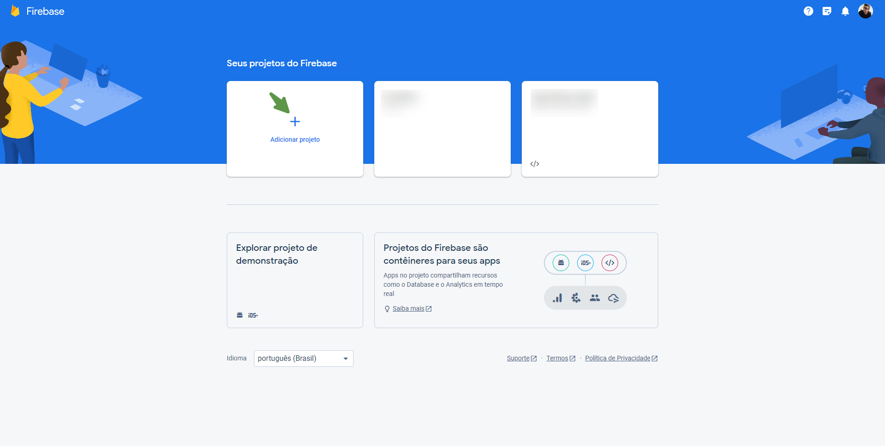

---

# Configuração do Firebase - Criar Projeto

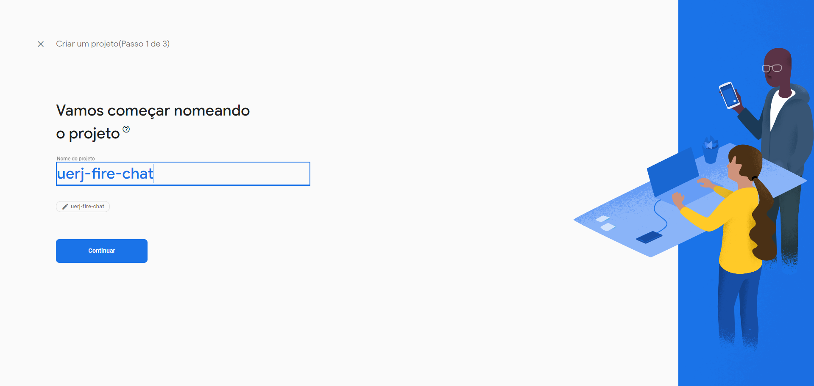

---

# Configuração do Firebase - Criar Projeto


---

# Configuração do Firebase - Criar Projeto


---

# Configuração do Firebase - Criar Projeto


---

# Configuração do Firebase - Criar Projeto

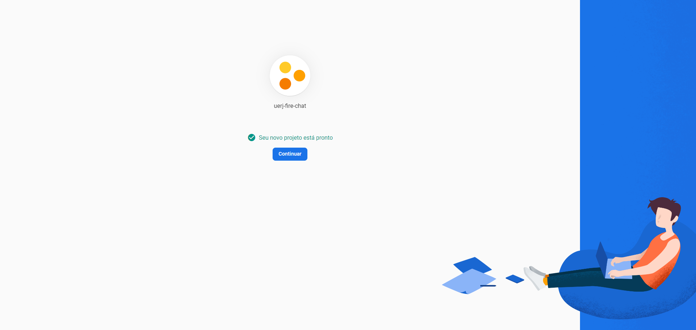

---

# Configuração do Firebase - Criar Projeto


---

# Configuração do Firebase - Criar Projeto

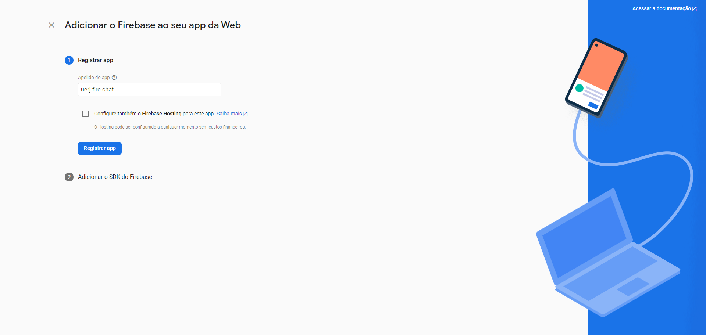

---

# Configuração do Firebase - Criar Projeto

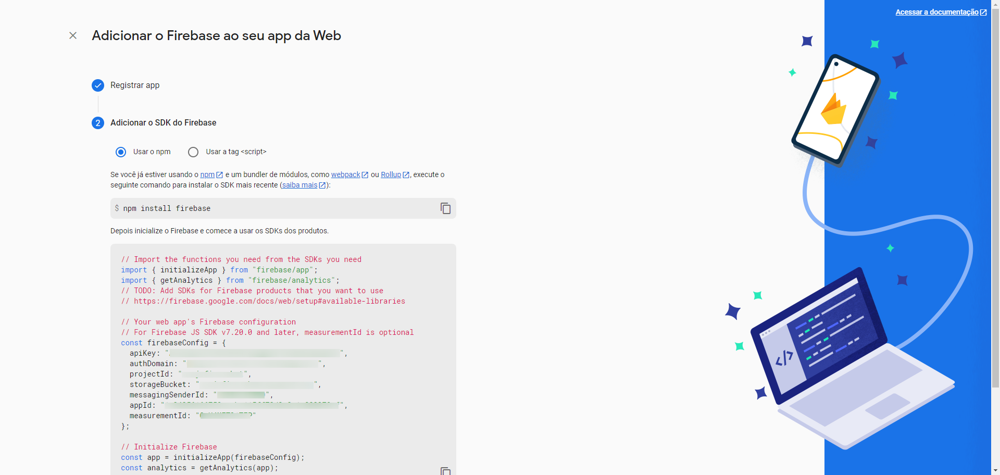

---

# Configuração do Firebase - Autenticação


---

# Configuração do Firebase - Autenticação

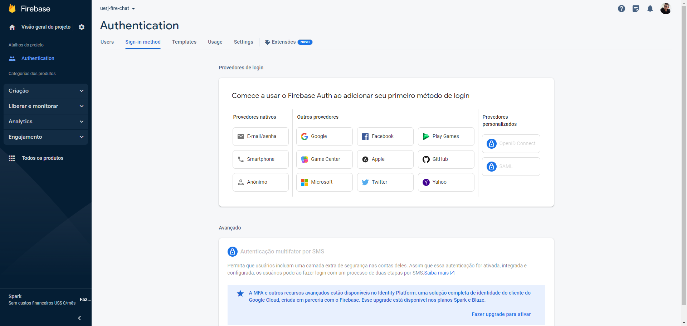

---

# Configuração do Firebase - Autenticação

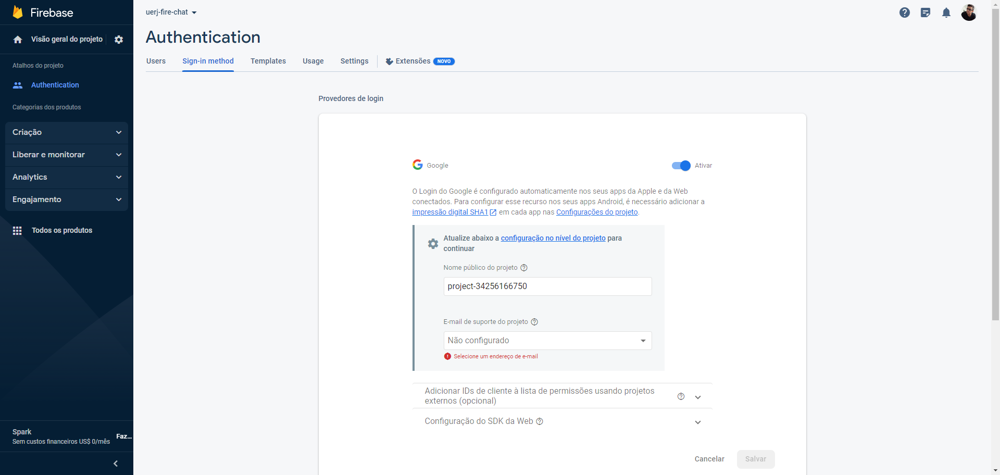

---

# Configuração do Firebase - Autenticação

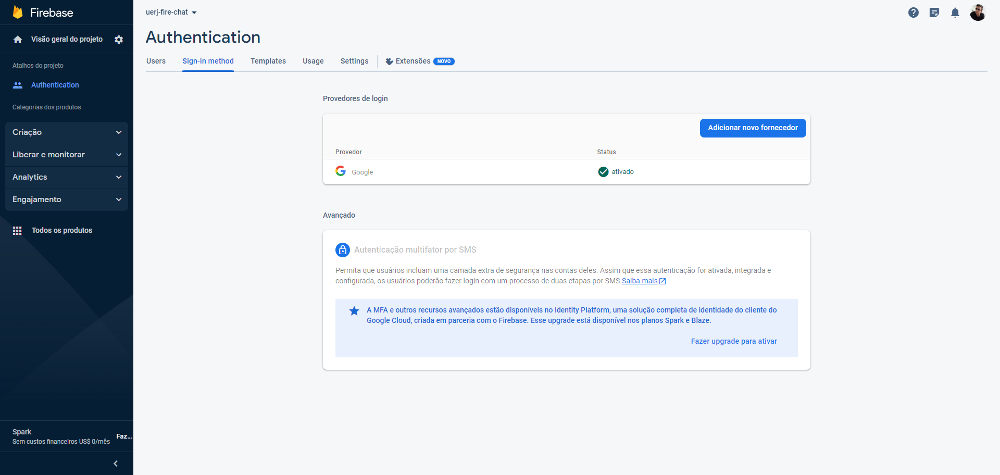

---

# Instalando o SDK do Firebase

```bash

npm install firebase

```

---

# Instalando o React Firebase Hooks

```bash

npm i react-firebase-hooks

```

---

# Inserindo as configurações no React - .env

**Criar um arquivo <code>.env</code>**

```yaml
REACT_APP_API_KEY = ""
REACT_APP_AUTH_DOMAIN = ""
REACT_APP_PROJECT_ID = ""
REACT_APP_STORAGE_BUCKET = ""
REACT_APP_MESSAGING_SENDER_ID = ""
REACT_APP_APP_ID = ""
REACT_APP_MEASUREMENT_ID = ""
```

---

# Inserindo as configurações no React - .App.js

```jsx
import { initializeApp } from "firebase/app";
import { getAuth } from "firebase/auth";
import { getFirestore } from "firebase/firestore";

const firebaseConfig = {
  apiKey: process.env.REACT_APP_API_KEY,
  authDomain: process.env.REACT_APP_AUTH_DOMAIN,
  projectId: process.env.REACT_APP_PROJECT_ID,
  storageBucket: process.env.REACT_APP_STORAGE_BUCKET,
  messagingSenderId: process.env.REACT_APP_MESSAGING_SENDER_ID,
  appId: process.env.REACT_APP_APP_ID,
  measurementId: process.env.REACT_APP_MEASUREMENT_ID,
};

const firebaseApp = initializeApp(firebaseConfig);
const auth = getAuth(firebaseApp);
const firestore = getFirestore(firebaseApp);

function App() {}
```

---

# Inserindo o React Firebase Hooks

```jsx
import { useAuthState } from "react-firebase-hooks/auth";

function App() {
  const [user] = useAuthState(auth);
}
```

---

# Preparando o botão de login (Google) - SignIn.jsx

```jsx
import "./SignIn.css";
import { GoogleAuthProvider, signInWithPopup } from "firebase/auth";

function SignIn({ auth }) {
  const signInWithGoogle = () => {
    const provider = new GoogleAuthProvider();
    signInWithPopup(auth, provider);
  };
  return (
    <div className="sign-in">
      <button onClick={signInWithGoogle}>
        <div>
          
        </div>
        <div>Sign in with Google</div>
      </button>
    </div>
  );
}

export default SignIn;
```

---

# Criando o SignOut.jsx

```jsx
import "./SignOut.css";

function SignOut({ auth }) {
  return (
    auth.currentUser && (
      <div className="sign-out">
        
        <button onClick={() => auth.signOut()}>
          
        </button>
      </div>
    )
  );
}

export default SignOut;
```

---

# CSS - SignOut.css

```css
.sign-out {
  display: grid;
  grid-template-columns: 60px 60px;
  height: 60px;
  align-items: center;
}

.avatar {
  width: 40px;
  height: 40px;
  border-radius: 50%;
}

button {
  height: 60px;
  display: grid;
  align-items: center;
  justify-content: center;
  border: none;
  background-color: transparent;
  cursor: pointer;
}
button:hover {
  background-color: rgba(0, 0, 0, 0.06);
}

img {
  height: 35px;
  display: block;
}
```

---

# Buscando Mensagens do Firebase - HTML

```jsx
return (
  <>
    <div className="chat-room">
      <main>
        {messages &&
          messages.map((msg, index) => (
            <ChatMessage key={index} message={msg} auth={auth} />
          ))}
      </main>
    </div>
  </>
);
```

---

# Importando Mensagens do Firebase - JS

```jsx
import { collection, limit, orderBy, query } from "firebase/firestore";
import { useCollectionData } from "react-firebase-hooks/firestore";
import ChatMessage from "./ChatMessage";

function ChatRoom() {
  const messagesRef = collection(firestore, "messages");
  const dbQuery = query(messagesRef, orderBy("createdAt"), limit(25));
  const collectionDataOption = { idField: "id" };
  const [messages] = useCollectionData(dbQuery, collectionDataOption);
  // restante do código
}
```

---

# Atribuição por Desestruturação

```jsx

const [a, b] = array; // [1,2]

const { a, b } = obj;
/**
 * {
 *  a: 1,
 *  b: 2
 * }
 * /

```

---

# Importando Mensagens do Firebase - Atualizando ChatMessage

```jsx
return (
  <>
    <div className={`message ${messageClass}`}>
      <div className="bubble">
        {messageClass === "sent" ? (
          ""
        ) : (
          
        )}
        <div className="display-message">
          {messageClass === "sent" ? "" : <strong>{displayName}</strong>}
          <p>{text}</p>
          <small>{sentTime === "Invalid Date" ? "" : sentTime}</small>
        </div>
      </div>
    </div>
  </>
);
```

---

# Importando Mensagens do Firebase - Atualizando ChatMessage

```jsx
function ChatMessage(props) {
  const { text, uid, photoURL, createdAt, displayName } = props.message;
  const auth = props.auth;

  const sentTime = new Date(createdAt?.seconds * 1000).toLocaleTimeString([], {
    hour: "2-digit",
    minute: "2-digit",
  });

  const messageClass = uid === auth?.currentUser?.uid ? "sent" : "received";

  // ...
}
```

---

# Atualização do ChatRoom

1. Precisamos da informação do usuário.
2. Precisamos da instância (autenticada) do banco de dados;

---

# App.js

Enviando os paramêtros.

```jsx
{
  user ? (
    <ChatRoom firestore={firestore} auth={auth} />
  ) : (
    <SignIn auth={auth} />
  );
}
```

---

# ChatRoom.jsx

Recebendo os parâmetros.

```jsx
function ChatRoom({ firestore, auth }) {
  // ....
}
```

---

# Status Atual da Aplicação

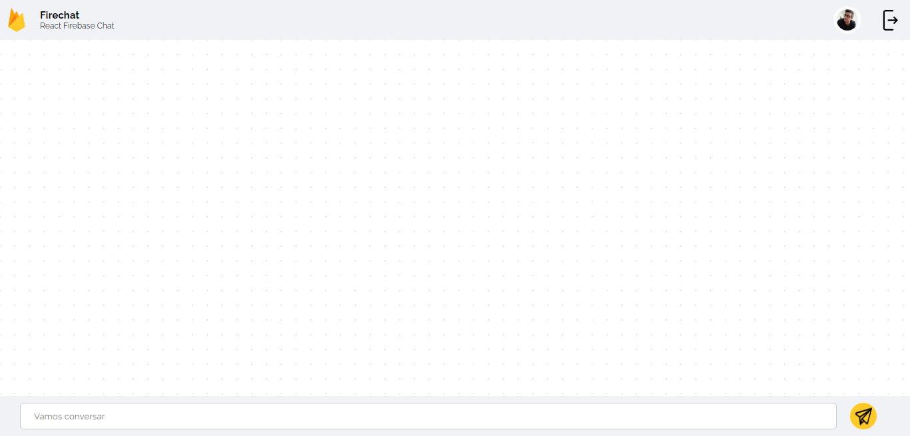

---

# Testando a Lista de Mensagens


---

# Testando a Lista de Mensagens

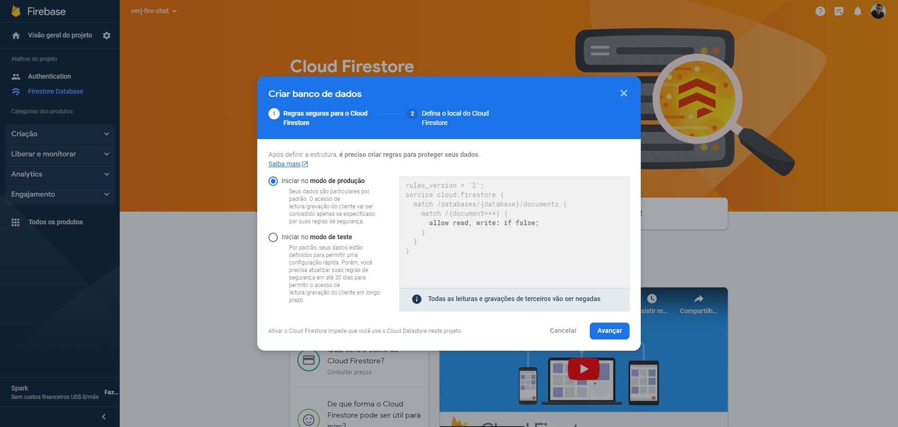

---

# Testando a Lista de Mensagens

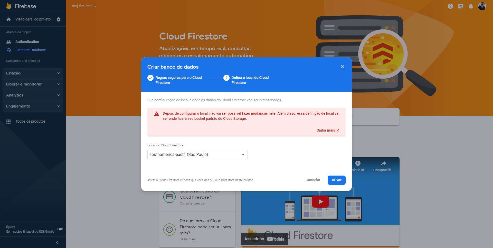

---

# Testando a Lista de Mensagens

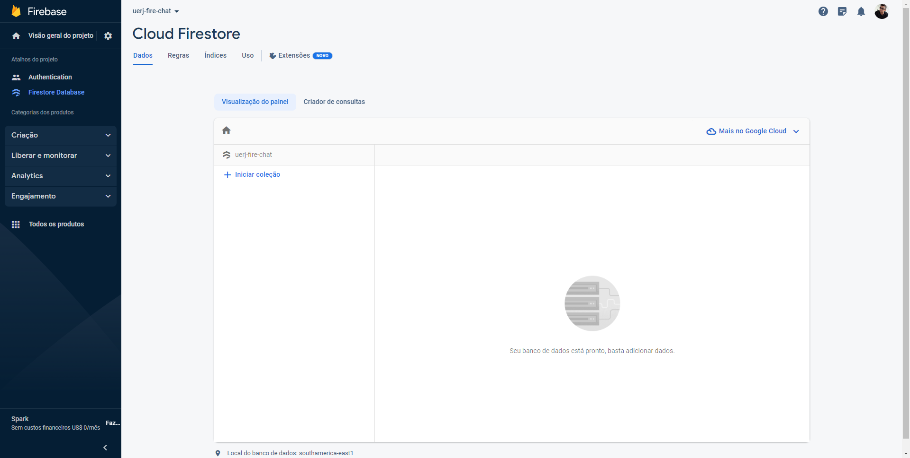

---

# Testando a Lista de Mensagens

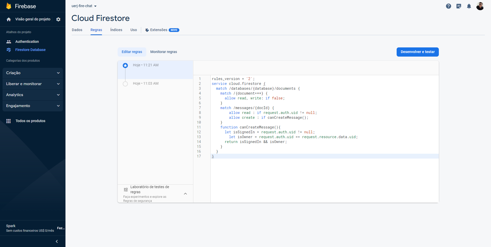

---

# Regras de Acesso do Banco - Firestore

```js

rules_version = '2';
service cloud.firestore {
  match /databases/{database}/documents {
    match /{document=**} {
    	allow read, write: if false;
    }
    match /messages/{docId} {
        allow read : if request.auth.uid != null;
        allow create : if canCreateMessage();
    }
    function canCreateMessage(){
    	let isSignedIn = request.auth.uid != null;
        let isOwner = request.auth.uid == request.resource.data.uid;
      return isSignedIn && isOwner;
    }
  }
}

```

---

# React Hooks

Os hooks permitem o uso de state e outros recursos que antes só eram possíveis dentro do React através de classes.

---

# useState

O React Hook **useState** é uma função que permite a criação e o gerenciamento do estado local de um componente. Ao utilizar esse hook, é possível definir uma variável de estado e uma função que atualiza essa variável, que são retornadas em um array como resultado. Dessa forma, é possível modificar e atualizar o estado do componente de forma eficiente, evitando problemas com a mutabilidade de variáveis em JavaScript.

```js
const [state, setState] = useState(initialState);
```

---

# Atualizando o ChatRoom.jsx

```js
import { useRef, useState } from "react";

function ChatRoom({ firestore, auth }) {
  // ... código
  const [formValue, setFormValue] = useState("");

  // formValue -> Valor do Formulário
  // setFormValue -> Função para alterar o estado de formValue
}
```

---

# Convenções do useState

- <code>useState</code> retorna um _array_ com 2 índices (2 posições);
- Primeiro valor -> variável que guarda o estado (o valor);
- Segundo valor -> função que nos permite tualizar o estado (o valor). **Atenção**: Podemos nomear a função como desejar, embora seja uma conveção usar o _prefixo_ **set**.

```js
// exemplos:
const [formValue, setFormValue] = useState("");
const [userName, setUserName] = useState("");
```

---

# Implementando o comportamento do "enviar"

```jsx
return (
  <>
    <div className="chat-room">
      <main>
        {messages &&
          messages.map((msg, index) => (
            <ChatMessage key={index} message={msg} auth={auth} />
          ))}
        {/* <span ref={forceBottomScrollElement}></span> */}
      </main>
      <div className="form">
        <form onSubmit={sendMessage}>
          <input
            value={formValue}
            onChange={(e) => setFormValue(e.target.value)}
            placeholder="Vamos conversar"
            type="text"
          />
          <button type="submit" disabled={!formValue}>
            
          </button>
        </form>
      </div>
    </div>
  </>
);
```

---

# Comportamento do Clique (enviar)

```js
const sendMessage = async (e) => {
  const { uid, photoURL, displayName } = auth.currentUser;

  const docRef = await addDoc(messagesRef, {
    text: formValue,
    createdAt: serverTimestamp(),
    uid,
    photoURL,
    displayName,
  });

  setFormValue("");
};
```

---

# Atualizando o import do firestore

```js
import {
  addDoc,
  collection,
  limit,
  orderBy,
  query,
  serverTimestamp,
} from "firebase/firestore";
```

---

# Problema - A página está recarregando!

```js

const sendMessage = async (e) => {
    console.log(e);
    e.preventDefault();
    // retante do código
}

```